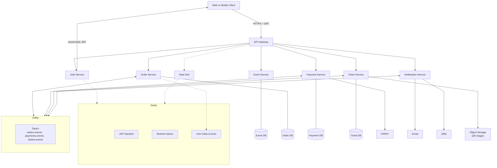
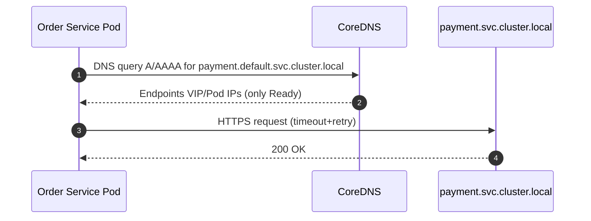
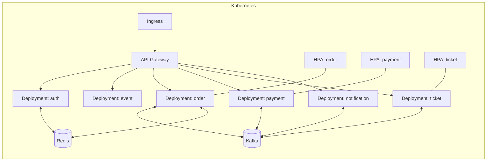
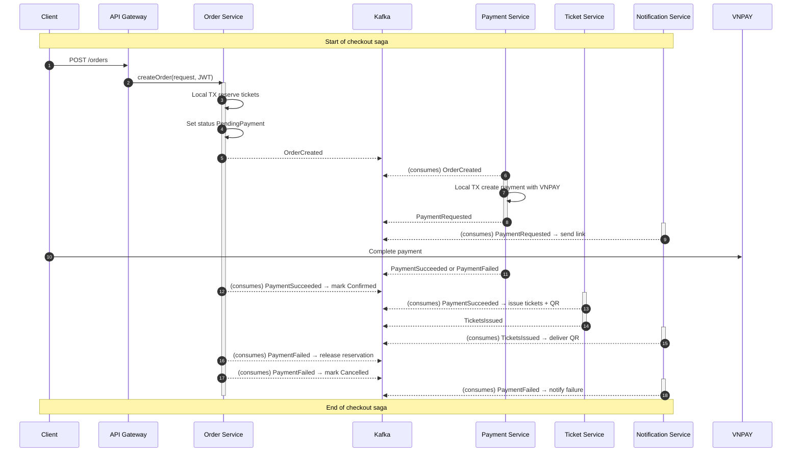

# VI. Applying Alternative Architecture Patterns

## VI.1 Applying the Microservices architecture

### 1. Problem Identification

In the current monolithic/layered architecture, modules such as event management, ticket booking, payment, and user management are tightly coupled within a single deployable unit. This creates the following non-functional limitations based on our project’s NFRs:

- **Performance (5,000 concurrent users)** – Single process and shared resources (DB connections, threads, GC) limit horizontal scaling on hot paths (inventory, checkout), causing contention during peak sales.
- **Availability (99.5% uptime)** – Any fault or rollout in one module impacts the whole app; no per-module health isolation or rolling deploys.
- **Reliability (≤0.1% transaction error)** – Cross-module calls are in-process without standardized idempotency/saga handling, increasing risk of partial failures for orders/payments.
- **Security (data protection)** – Coarse-grained trust boundary and secrets make least-privilege and per-module access control difficult; uniform session handling increases blast radius.
- **Scalability (10x spikes via load balancing)** – Entire app must scale together; cannot independently scale Inventory/Order/Payment services during launches.
- **Backup & Recovery (≤2h restore)** – Single large database slows restore and lacks per-domain recovery; limited support for event/outbox replays.
- **Monitoring & Logging (alerts for critical flows)** – Limited module-level visibility and SLOs; difficult to correlate logs and traces across business flows.
- **Notifications & Reporting (scheduled jobs)** – Cron jobs compete with request traffic; long-running jobs affect latency and cannot scale independently.

### 2. Microservice-Based Solution

Redesign the system using a **Microservices Architecture**, where each major function is an independent service communicating over HTTP (REST) via an **API Gateway**. Each service owns its data (database-per-service) and can be scaled and deployed independently.

- **Proposed Services (logical boundaries):**
  - Auth Service (authentication, sessions)
  - Event Service (events, categories)
  - Inventory Service (ticket types, stock reservation/release)
  - Order Service (orders, checkout, idempotency)
  - Payment Service (payment provider integration, webhooks)
  - Refund Service (refund policies and execution)
  - Notification Service (email/SMS/push, reminders)
  - Reporting/Analytics Service (sales reports)
  - Support Service (support tickets)

- **Gateway & Cross-Cutting:**
  - API Gateway for routing, rate limiting, and authentication offloading
  - Service Discovery for dynamic endpoint resolution
  - Observability (centralized logging, metrics, tracing)
  - Resilience (timeouts, retries, circuit breakers)

This solution directly addresses the limitations:
- Reusability: Clean APIs per service enable external/mobile reuse.
- Scalability: Scale hot services (e.g., Inventory/Order/Payment) independently.
- Maintainability: Smaller blast radius, independent deploys, clearer ownership.

### 3. Supporting Diagrams (documentation scope)

- Component Diagram (high-level logical):

  Frontend → API Gateway → { Auth | Event | Inventory | Order | Payment | Refund | Notification | Reporting | Support }

  Each service → its own database.

- Deployment Diagram (conceptual):

  Client → Load Balancer → API Gateway (N instances)

  API Gateway → Services (each N instances) → Databases (per service)

- Sequence (Checkout, conceptual):

  Frontend → Gateway → Order Service → Inventory Service (reserve)

  → Payment Service (initiate/confirm) → Order Service (confirm) → Notification Service

Note: This file documents intent and scope only. No code changes are implied.


#### Mermaid Diagrams (Lean per use case)



## VI.2 Applying Service Discovery Pattern (Kubernetes-based microservices)

### 1. Problem & Requirement

- Non-functional driver: **NF-05 Scalability** and **High Availability**. As we horizontally scale services like `order`, `payment`, and `ticket` to handle spikes (e.g., flash sales), instance IPs are ephemeral.
- In a growing system with multiple independently deployable services (Auth, Event, Order, Payment, Ticket, Notification), we must support:
  - Dynamic endpoint resolution without hardcoding IPs/ports
  - Health-aware routing to only-ready instances
  - Zero-downtime rolling updates and auto-scaling (HPA)
  - Multi-environment isolation (dev/stage/prod) with consistent naming
- Without discovery, client modules (or the API Gateway) become brittle, requiring frequent redeploys when topology changes.

### 2. Service Discovery-Based Solution

Integrate a dedicated discovery mechanism that decouples clients from instance addresses.

- Kubernetes-first approach (recommended for the alternate microservice + K8s target):
  - Use native **Kubernetes Services** for stable virtual IPs and DNS names (ClusterIP/Headless) backed by **Endpoints**.
  - **CoreDNS** provides DNS-based service discovery: `http://order.default.svc.cluster.local`.
  - Combine with **readiness/liveness probes** so only healthy Pods receive traffic.
  - External exposure via **Ingress** or **Gateway API**; internal calls use `*.svc.cluster.local`.
  - Optional: **Service Mesh** (e.g., Istio) for advanced discovery, mTLS, traffic shifting, and circuit breaking.

- Alternative registries (non-Kubernetes or hybrid):
  - **Consul**: Agent-based health checks, KV, multi-datacenter, DNS/HTTP API
  - **Netflix Eureka**: Java-first client-side discovery for Spring Cloud Netflix stacks
  - Discovery abstraction: implement via sidecar/adapter so the app code remains registry-agnostic

Client resolution patterns:
- API Gateway or services call others using DNS names (e.g., `http://payment:8080`).
- In non-K8s, use registry client libraries (Eureka/Consul) with retry/timeouts.

Alignment with @usecase.mdc:
- Supports NF-06 Scalability and high availability by enabling horizontal scaling and rolling updates.
- Enhances reliability for critical flows (order reservation FR16, payment, ticket issuance FR6) through health-aware routing.
- Facilitates independent scaling per domain per the microservices boundaries.

### 3. Supporting Diagrams

#### 3.1 Deployment Diagram (Kubernetes with discovery registry)

```mermaid
flowchart LR
  subgraph K8s[ Kubernetes Cluster ]
    IG[Ingress / Gateway API]
    IG --> GW[API Gateway (Deployment)]

    subgraph NS[Namespace: default]
      AU_DEP[Deployment: auth]
      EV_DEP[Deployment: event]
      OR_DEP[Deployment: order]
      PY_DEP[Deployment: payment]
      TK_DEP[Deployment: ticket]
      NF_DEP[Deployment: notification]

      AU_SVC[(Service: auth)]
      EV_SVC[(Service: event)]
      OR_SVC[(Service: order)]
      PY_SVC[(Service: payment)]
      TK_SVC[(Service: ticket)]
      NF_SVC[(Service: notification)]

      AU_DEP --- AU_SVC
      EV_DEP --- EV_SVC
      OR_DEP --- OR_SVC
      PY_DEP --- PY_SVC
      TK_DEP --- TK_SVC
      NF_DEP --- NF_SVC

      HPA_OR[HPA: order] --- OR_DEP
      HPA_PY[HPA: payment] --- PY_DEP
      HPA_TK[HPA: ticket] --- TK_DEP

      %% Discovery plane
      DNS[(CoreDNS)]
      DNS --- AU_SVC
      DNS --- EV_SVC
      DNS --- OR_SVC
      DNS --- PY_SVC
      DNS --- TK_SVC
      DNS --- NF_SVC
    end

    GW --> AU_SVC
    GW --> EV_SVC
    GW --> OR_SVC
    GW --> PY_SVC
    GW --> TK_SVC
    GW --> NF_SVC
  end

  PY_DEP --> VNP[VNPAY]
```

#### 3.2 Updated Component Diagram (with Discovery Service)

```mermaid
flowchart TB
  Client --> GW[API Gateway]
  GW --> Auth
  GW --> Event
  GW --> Order
  GW --> Payment
  GW --> Ticket
  GW --> Notification

  subgraph Discovery[Discovery Service]
    CDNS[CoreDNS + K8s Service Registry]
  end

  Auth -. resolves .-> Discovery
  Event -. resolves .-> Discovery
  Order -. resolves .-> Discovery
  Payment -. resolves .-> Discovery
  Ticket -. resolves .-> Discovery
  Notification -. resolves .-> Discovery

  note right of Discovery: Stable DNS names (svc.cluster.local)
```

#### 3.3 Service Discovery Sequence (DNS-based lookup)



Notes:
- Health probes ensure only Ready Pods are in Endpoints; rolling updates swap endpoints seamlessly.
- For stateful components, prefer Headless Services (`clusterIP: None`) and stable network identities via StatefulSets.
- If extending beyond K8s, introduce a discovery adapter to support Consul/Eureka without changing business code.




