# Class Diagram for Ticketbook System

```mermaid
classDiagram
    %% Enumerations
    class UserRole {
        <<enumeration>>
        +CUSTOMER
        +VERIFIED_ORGANIZER
        +ADMIN
        +getDisplayName() String
    }

    class EventStatus {
        <<enumeration>>
        +DRAFT
        +PENDING_APPROVAL
        +ACTIVE
        +INACTIVE
        +CANCELLED
        +COMPLETED
        +getDisplayName() String
    }

    class BookingStatus {
        <<enumeration>>
        +PENDING_PAYMENT
        +CONFIRMED
        +EXPIRED
        +CANCELLED
        +COMPLETED
        +getDisplayName() String
    }

    class TicketStatus {
        <<enumeration>>
        +AVAILABLE
        +CONFIRMED
        +USED
        +REFUNDED
        +CANCELLED
        +getDisplayName() String
    }

    class PaymentStatus {
        <<enumeration>>
        +PENDING
        +PAID
        +FAILED
        +REFUNDED
        +getDisplayName() String
    }

    class RefundStatus {
        <<enumeration>>
        +PENDING_ADMIN_REVIEW
        +APPROVED_PROCESSING
        +COMPLETED
        +REJECTED
        +getDisplayName() String
    }

    class SupportTicketStatus {
        <<enumeration>>
        +PENDING
        +IN_PROGRESS
        +RESOLVED
        +CLOSED
        +getDisplayName() String
    }

    %% Core Entities
    class User {
        -Long userId
        -String fullName
        -String contact
        -String password
        -UserRole role
        -LocalDateTime registrationDate
        -LocalDateTime lastLogin
        -Boolean isDeleted
        -LocalDateTime deletedAt
        -String oauthProvider
        -String oauthProviderId
        -Boolean isVerified
        -Integer failedLoginAttempts
        -LocalDateTime accountLockedUntil
        +isAccountLocked() Boolean
        +incrementFailedLoginAttempts() void
        +resetFailedLoginAttempts() void
        +softDelete() void
        +isEmail() Boolean
        +isPhone() Boolean
        +getEmail() String
        +getPhone() String
    }

    class Event {
        -Long eventId
        -String name
        -String description
        -String eventType
        -LocalDateTime startDate
        -LocalDateTime endDate
        -String location
        -Integer maxTicketQuantity
        -EventStatus status
        -String posterImage
        -String organizerCommittee
        -String venueName
        -Boolean refundAllowed
        -LocalDateTime createdAt
        -LocalDateTime updatedAt
        +hasOccurred() Boolean
        +isOngoing() Boolean
    }

    class Order {
        -Long orderId
        -BigDecimal totalAmount
        -Integer totalQuantity
        -LocalDateTime orderDate
        -BookingStatus bookingStatus
        -String recipientName
        -String recipientPhone
        -String recipientEmail
        -String recipientAddress
        -String recipientNotes
        -LocalDateTime reservationExpiresAt
        -LocalDateTime completedAt
        +isExpired() Boolean
        +extendReservation() void
        +confirm() void
        +cancel() void
        +expire() void
    }

    class Ticket {
        -Long ticketId
        -String qrCode
        -String seatNumber
        -TicketStatus status
        -LocalDateTime checkInDateTime
        -LocalDateTime createdAt
        +checkIn() void
        +refund() void
        +canCheckIn() Boolean
    }

    class TicketType {
        -Long ticketTypeId
        -BigDecimal price
        -Integer ticketQuantity
        -Integer availableQuantity
        -String typeName
        -String description
        -LocalDateTime saleStartDate
        -LocalDateTime saleEndDate
        +isAvailable() Boolean
        +reserve(Integer quantity) void
        +release(Integer quantity) void
    }

    class Payment {
        -Long paymentId
        -String vnpayTransactionId
        -BigDecimal amount
        -LocalDateTime paymentDate
        -PaymentStatus paymentStatus
        -String paymentMethod
        +markAsPaid(String transactionId) void
        +markAsFailed() void
        +refund() void
    }

    class Category {
        -Long categoryId
        -String name
        -String description
    }

    %% Supporting Entities
    class OrganizerProfile {
        -Long organizerId
        -String organizationName
        -String businessRegistrationNumber
        -String taxId
        -String businessAddress
        -String contactPerson
        -String businessPhone
        -String businessEmail
        -String bankName
        -String bankAccountNumber
        -String bankAccountHolderName
        -String bankBranch
        -String idDocumentPath
        -String businessRegistrationDocumentPath
        -String taxDocumentPath
        -String addressProofDocumentPath
        -String kycStatus
        -LocalDateTime kycSubmittedAt
        -LocalDateTime kycApprovedAt
        -Long kycApprovedBy
        -String kycRejectionReason
        -LocalDateTime createdAt
        +isKycApproved() Boolean
        +approveKyc(Long adminId) void
        +rejectKyc(String reason) void
    }

    class Session {
        -Long sessionId
        -String sessionToken
        -LocalDateTime createdAt
        -LocalDateTime expiresAt
        -LocalDateTime lastActivity
        -String ipAddress
        -String userAgent
        -Boolean isActive
        +isValid() Boolean
        +updateActivity() void
        +invalidate() void
    }

    class RefundInfo {
        -Long requestId
        -String reason
        -RefundStatus status
        -BigDecimal refundAmount
        -String adminNotes
        -Long approvedBy
        -LocalDateTime requestDate
        -LocalDateTime processedDate
        +approve(Long adminId, String notes) void
        +reject(String notes) void
        +complete() void
    }

    class SupportTicket {
        -Long requestId
        -String category
        -String subject
        -String description
        -SupportTicketStatus status
        -String organizerResponse
        -LocalDateTime createdAt
        -LocalDateTime respondedAt
        -LocalDateTime resolvedAt
        +markInProgress() void
        +resolve(String response) void
        +close() void
    }

    class EventUpdateRequest {
        -Long requestId
        -String justification
        -String proposedName
        -String proposedDescription
        -String proposedLocation
        -String proposedVenueName
        -LocalDateTime proposedStartDate
        -LocalDateTime proposedEndDate
        -Integer proposedMaxTicketQuantity
        -Boolean proposedRefundAllowed
        -String status
        -LocalDateTime requestedAt
        -LocalDateTime reviewedAt
        -Long reviewedBy
        -String adminNotes
        +approve(Long adminId, String notes) void
        +reject(Long adminId, String notes) void
        +isPending() Boolean
    }

    class WithdrawalRequest {
        -Long requestId
        -BigDecimal amount
        -BigDecimal availableBalance
        -BigDecimal platformFee
        -String bankName
        -String bankAccountNumber
        -String bankAccountHolder
        -String bankBranch
        -String status
        -LocalDateTime requestedAt
        -LocalDateTime reviewedAt
        -Long reviewedBy
        -LocalDateTime processedAt
        -String adminNotes
        -String transactionReference
        +approve(Long adminId, String notes) void
        +reject(Long adminId, String notes) void
        +markAsProcessing() void
        +complete(String transactionRef) void
        +isPending() Boolean
    }

    class PasswordResetToken {
        -Long tokenId
        -String tokenValue
        -LocalDateTime expiryTime
        -Boolean isUsed
        -LocalDateTime createdAt
        -LocalDateTime usedAt
        +isValid() Boolean
        +markAsUsed() void
        +isExpired() Boolean
    }

    class AuditLog {
        -Long logId
        -Long userId
        -String username
        -String actionType
        -String entityType
        -Long entityId
        -String description
        -String ipAddress
        -String userAgent
        -LocalDateTime timestamp
        -String result
        -String errorMessage
        -String oldValue
        -String newValue
        +createLoginLog(Long userId, String username, String ipAddress)$ AuditLog
        +createEventCreationLog(Long userId, String username, Long eventId)$ AuditLog
        +createRefundApprovalLog(Long adminId, String adminName, Long refundId)$ AuditLog
        +createKycApprovalLog(Long adminId, String adminName, Long organizerId)$ AuditLog
    }

    %% Relationships - Associations with multiplicities
    User "1" --> "*" Order : places
    User "1" --> "*" Event : organizes
    User "1" --> "*" RefundInfo : requests
    User "1" --> "*" SupportTicket : submits
    User "1" --> "*" EventUpdateRequest : requests
    User "1" --> "*" WithdrawalRequest : requests
    User "1" --> "*" PasswordResetToken : has
    
    Event "1" --> "*" Order : receives
    Event "1" --> "*" SupportTicket : receives
    Event "1" --> "*" EventUpdateRequest : has
    Event "0..1" --> "*" WithdrawalRequest : relates to
    
    Order "0..1" --> "*" SupportTicket : relates to
    
    Ticket "1" --> "0..1" RefundInfo : may have
    TicketType "1" --> "*" Ticket : has

    %% Composition relationships (strong ownership)
    User *-- Session : owns
    User *-- OrganizerProfile : owns
    Event *-- TicketType : contains
    Order *-- Ticket : contains
    Order *-- Payment : has

    %% Aggregation relationships (weak ownership)
    Category o-- Event : categorizes

    %% Dependency relationships (for enums)
    User ..> UserRole : uses
    Event ..> EventStatus : uses
    Order ..> BookingStatus : uses
    Ticket ..> TicketStatus : uses
    Payment ..> PaymentStatus : uses
    RefundInfo ..> RefundStatus : uses
    SupportTicket ..> SupportTicketStatus : uses
```

## Relationship Summary

### Associations (with multiplicities)
- **User** ↔ **Session**: 1 to many (User has many Sessions)
- **User** ↔ **OrganizerProfile**: 1 to 0..1 (User may have one OrganizerProfile)
- **User** ↔ **Order**: 1 to many (User places many Orders)
- **User** ↔ **Event**: 1 to many (User organizes many Events)
- **Event** ↔ **TicketType**: 1 to many (Event has many TicketTypes)
- **Event** ↔ **Order**: 1 to many (Event receives many Orders)
- **Order** ↔ **Ticket**: 1 to many (Order contains many Tickets)
- **Order** ↔ **Payment**: 1 to 1 (Order has one Payment)
- **Ticket** ↔ **RefundInfo**: 1 to 0..1 (Ticket may have one RefundInfo)
- **Category** ↔ **Event**: 1 to many (Category categorizes many Events)

### Composition (strong ownership)
- **User** *-- **Session**: Sessions are owned by User (if User deleted, Sessions deleted)
- **User** *-- **OrganizerProfile**: Profile is owned by User
- **Event** *-- **TicketType**: TicketTypes are owned by Event
- **Order** *-- **Ticket**: Tickets are owned by Order
- **Order** *-- **Payment**: Payment is owned by Order

### Aggregation (weak ownership)
- **Event** o-- **Category**: Event references Category but Category can exist independently

### Generalization/Specialization
- All enums (UserRole, EventStatus, BookingStatus, etc.) are used by entities but are not part of an inheritance hierarchy in this model

### Visibility Notations
- **-**: Private attributes and methods
- **+**: Public methods
- **#**: Protected (none in this model, but would be used for inheritance)

### Business Rules Referenced
- **FR1**: MD5 password hashing (User.password)
- **FR2**: Unique auto-generated event ID (Event.eventId)
- **FR3**: No price changes after sales start (TicketType)
- **FR4**: Unique order ID (Order.orderId)
- **FR5**: Single pending order per customer (Order.bookingStatus)
- **FR6**: Unique QR code per ticket (Ticket.qrCode)
- **FR7**: Refunds require Admin approval (RefundInfo.status)
- **FR8**: Refunded tickets invalidated (Ticket.status)
- **FR9**: Unique email/phone per user (User.contact unique)
- **FR10**: Password strength (User.password validation)
- **FR11**: Customer role at registration (User.role default)
- **FR12**: Account lockout (User.failedLoginAttempts, accountLockedUntil)
- **FR13**: Only Customers can self-delete (User.softDelete)
- **FR14**: Max tickets per order (TicketType, Event.maxTicketQuantity)
- **FR15**: No modifications to past events (Event.hasOccurred)
- **FR16**: 15-minute reservation timeout (Order.reservationExpiresAt)
- **FR17-FR26**: Role-based access, audit logging, validation, confirmations

