# Package Diagram - Ticket Booking System

This package diagram shows the package structure and dependencies for the Ticket Booking System using UML package notation.

```mermaid
graph TB
    subgraph "com.swd.ticketbook"
        direction TB
        
        %% Main Packages
        PKG_ROOT[com.swd.ticketbook<br/>Root Package]
        
        %% Layer Packages
        PKG_CONTROLLERS[controllers<br/>REST API Controllers]
        PKG_SERVICES[services<br/>Business Logic]
        PKG_REPOSITORIES[repositories<br/>Data Access]
        PKG_ENTITIES[entities<br/>Domain Models]
        PKG_DTO[dto<br/>Data Transfer Objects]
        PKG_ENUMS[enums<br/>Enumerations]
        PKG_EXCEPTIONS[exceptions<br/>Exception Classes]
        PKG_SECURITY[security<br/>Security & Authentication]
        PKG_CONFIG[config<br/>Configuration]
        PKG_UTILS[utils<br/>Utility Classes]
        PKG_CONSTANTS[constants<br/>Constants]
        
        %% DTO Sub-packages
        PKG_DTO_ADMIN[dto.admin<br/>Admin DTOs]
        PKG_DTO_AUTH[dto.auth<br/>Auth DTOs]
        PKG_DTO_CHECKIN[dto.checkin<br/>Check-in DTOs]
        PKG_DTO_EVENT[dto.event<br/>Event DTOs]
        PKG_DTO_ORDER[dto.order<br/>Order DTOs]
        PKG_DTO_ORGANIZER[dto.organizer<br/>Organizer DTOs]
        PKG_DTO_REFUND[dto.refund<br/>Refund DTOs]
        PKG_DTO_SUPPORT[dto.support<br/>Support DTOs]
        
        %% Security Sub-package
        PKG_SECURITY_VALIDATION[security.validation<br/>Validation]
        
        %% Package Nesting
        PKG_ROOT --> PKG_CONTROLLERS
        PKG_ROOT --> PKG_SERVICES
        PKG_ROOT --> PKG_REPOSITORIES
        PKG_ROOT --> PKG_ENTITIES
        PKG_ROOT --> PKG_DTO
        PKG_ROOT --> PKG_ENUMS
        PKG_ROOT --> PKG_EXCEPTIONS
        PKG_ROOT --> PKG_SECURITY
        PKG_ROOT --> PKG_CONFIG
        PKG_ROOT --> PKG_UTILS
        PKG_ROOT --> PKG_CONSTANTS
        
        PKG_DTO --> PKG_DTO_ADMIN
        PKG_DTO --> PKG_DTO_AUTH
        PKG_DTO --> PKG_DTO_CHECKIN
        PKG_DTO --> PKG_DTO_EVENT
        PKG_DTO --> PKG_DTO_ORDER
        PKG_DTO --> PKG_DTO_ORGANIZER
        PKG_DTO --> PKG_DTO_REFUND
        PKG_DTO --> PKG_DTO_SUPPORT
        
        PKG_SECURITY --> PKG_SECURITY_VALIDATION
        
        %% Dependencies (shown with dashed arrows)
        PKG_CONTROLLERS -.->|uses| PKG_SERVICES
        PKG_CONTROLLERS -.->|uses| PKG_DTO
        PKG_CONTROLLERS -.->|uses| PKG_SECURITY
        PKG_CONTROLLERS -.->|uses| PKG_EXCEPTIONS
        
        PKG_SERVICES -.->|uses| PKG_REPOSITORIES
        PKG_SERVICES -.->|uses| PKG_ENTITIES
        PKG_SERVICES -.->|uses| PKG_DTO
        PKG_SERVICES -.->|uses| PKG_ENUMS
        PKG_SERVICES -.->|uses| PKG_EXCEPTIONS
        
        PKG_REPOSITORIES -.->|uses| PKG_ENTITIES
        
        PKG_SECURITY -.->|uses| PKG_ENTITIES
        PKG_SECURITY -.->|uses| PKG_REPOSITORIES
        PKG_SECURITY -.->|uses| PKG_ENUMS
        
        PKG_DTO -.->|uses| PKG_ENTITIES
        PKG_DTO -.->|uses| PKG_ENUMS
        
        PKG_ENTITIES -.->|uses| PKG_ENUMS
        
        PKG_CONFIG -.->|uses| PKG_SECURITY
        
        PKG_UTILS -.->|uses| PKG_SECURITY
        
        PKG_DTO_ADMIN -.->|uses| PKG_ENTITIES
        PKG_DTO_AUTH -.->|uses| PKG_ENTITIES
        PKG_DTO_ORDER -.->|uses| PKG_ENTITIES
        PKG_DTO_ORGANIZER -.->|uses| PKG_ENTITIES
        PKG_DTO_REFUND -.->|uses| PKG_ENTITIES
        PKG_DTO_SUPPORT -.->|uses| PKG_ENTITIES
        PKG_DTO_CHECKIN -.->|uses| PKG_ENTITIES
        PKG_DTO_EVENT -.->|uses| PKG_ENTITIES
        
        %% Styling
        classDef rootPackage fill:#e1f5ff,stroke:#01579b,stroke-width:3px
        classDef layerPackage fill:#f3e5f5,stroke:#4a148c,stroke-width:2px
        classDef subPackage fill:#fff3e0,stroke:#e65100,stroke-width:1px
        
        class PKG_ROOT rootPackage
        class PKG_CONTROLLERS,PKG_SERVICES,PKG_REPOSITORIES,PKG_ENTITIES,PKG_DTO,PKG_ENUMS,PKG_EXCEPTIONS,PKG_SECURITY,PKG_CONFIG,PKG_UTILS,PKG_CONSTANTS layerPackage
        class PKG_DTO_ADMIN,PKG_DTO_AUTH,PKG_DTO_CHECKIN,PKG_DTO_EVENT,PKG_DTO_ORDER,PKG_DTO_ORGANIZER,PKG_DTO_REFUND,PKG_DTO_SUPPORT,PKG_SECURITY_VALIDATION subPackage
    end
    
    style PKG_ROOT fill:#e1f5ff,stroke:#01579b,stroke-width:3px
    style PKG_CONTROLLERS fill:#f3e5f5,stroke:#4a148c,stroke-width:2px
    style PKG_SERVICES fill:#f3e5f5,stroke:#4a148c,stroke-width:2px
    style PKG_REPOSITORIES fill:#f3e5f5,stroke:#4a148c,stroke-width:2px
    style PKG_ENTITIES fill:#f3e5f5,stroke:#4a148c,stroke-width:2px
    style PKG_DTO fill:#f3e5f5,stroke:#4a148c,stroke-width:2px
    style PKG_ENUMS fill:#f3e5f5,stroke:#4a148c,stroke-width:2px
    style PKG_EXCEPTIONS fill:#f3e5f5,stroke:#4a148c,stroke-width:2px
    style PKG_SECURITY fill:#f3e5f5,stroke:#4a148c,stroke-width:2px
    style PKG_CONFIG fill:#f3e5f5,stroke:#4a148c,stroke-width:2px
    style PKG_UTILS fill:#f3e5f5,stroke:#4a148c,stroke-width:2px
    style PKG_CONSTANTS fill:#f3e5f5,stroke:#4a148c,stroke-width:2px
```

## Package Structure Overview

### Root Package
- **com.swd.ticketbook**: Main application package

### Layer Packages
1. **controllers**: REST API endpoints (AdminController, AuthController, OrderController, etc.)
2. **services**: Business logic layer (OrderService, AuthService, EventService, etc.)
3. **repositories**: Data access layer (JPA repositories)
4. **entities**: Domain model classes (User, Event, Order, Ticket, etc.)
5. **dto**: Data Transfer Objects for API communication
6. **enums**: Enumeration types (UserRole, BookingStatus, EventStatus, etc.)
7. **exceptions**: Custom exception classes
8. **security**: Security and authentication components
9. **config**: Configuration classes (WebConfig)
10. **utils**: Utility classes
11. **constants**: Constants

### DTO Sub-packages
- **dto.admin**: Admin-related DTOs
- **dto.auth**: Authentication DTOs
- **dto.checkin**: Check-in DTOs
- **dto.event**: Event DTOs
- **dto.order**: Order DTOs
- **dto.organizer**: Organizer DTOs
- **dto.refund**: Refund DTOs
- **dto.support**: Support ticket DTOs

### Security Sub-package
- **security.validation**: Validation components

## Dependency Relationships

- **Controllers** depend on: Services, DTOs, Security, Exceptions
- **Services** depend on: Repositories, Entities, DTOs, Enums, Exceptions
- **Repositories** depend on: Entities
- **Security** depends on: Entities, Repositories, Enums
- **DTOs** depend on: Entities, Enums
- **Entities** depend on: Enums
- **Config** depends on: Security

