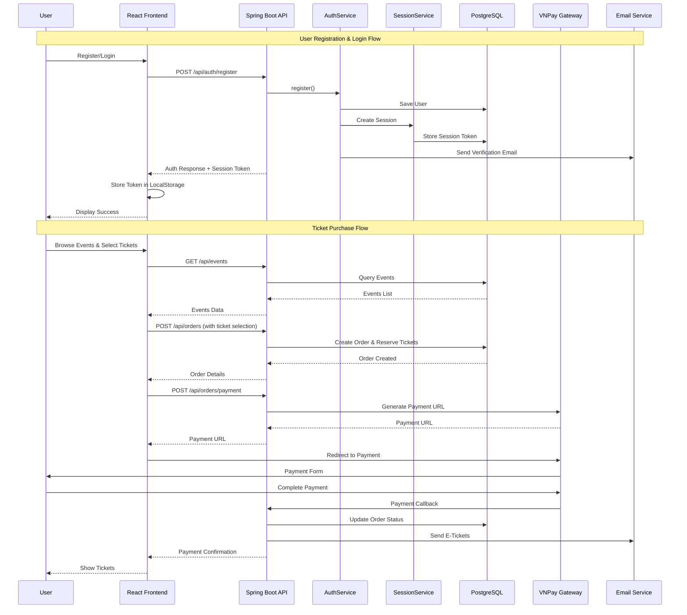
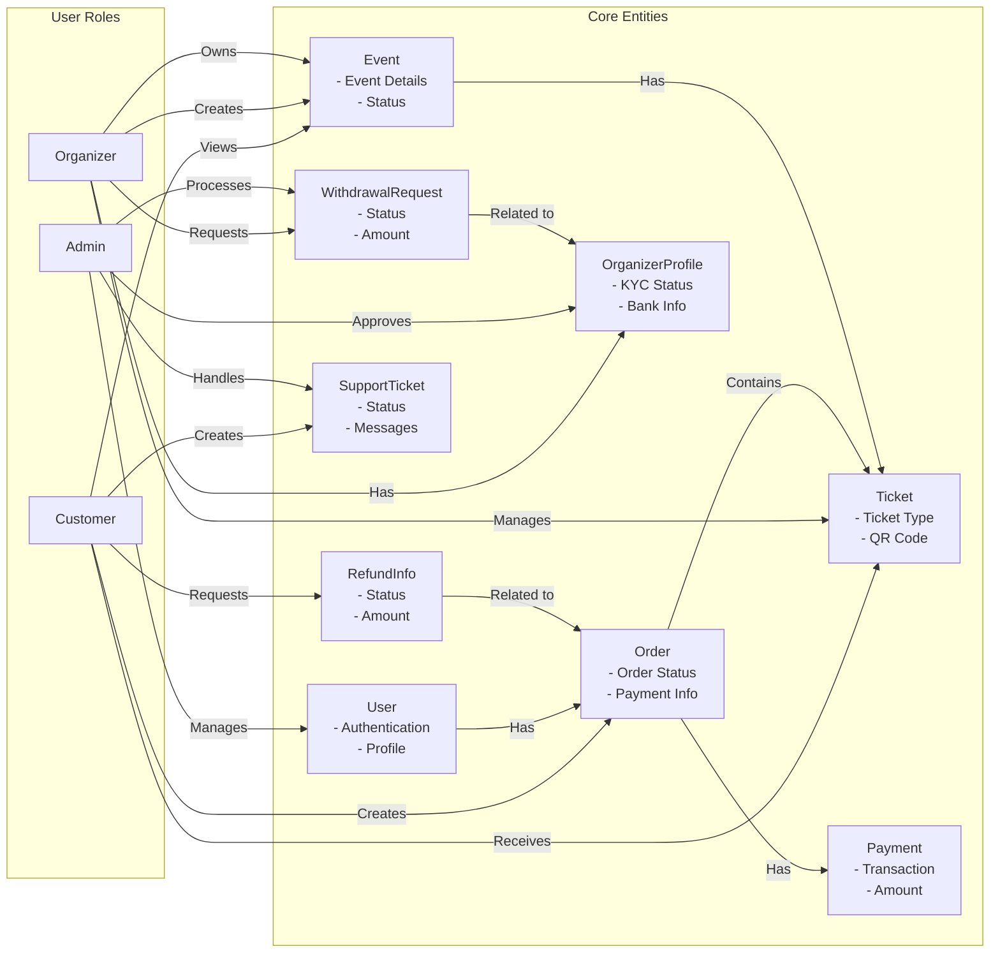
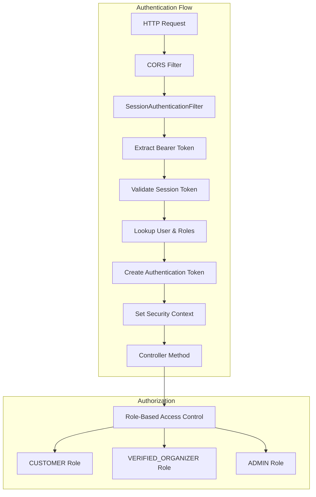

# Ticket Booking System - High Level Design

## System Architecture Diagram

```mermaid
graph TB
    subgraph "Client Layer"
        WEB[React Web Application<br/>- Customer Portal<br/>- Organizer Portal<br/>- Admin Dashboard]
        MOBILE[Mobile App<br/>Optional Future]
    end

    subgraph "API Gateway / Load Balancer"
        LB[Load Balancer<br/>Port 8080]
    end

    subgraph "Application Layer - Spring Boot REST API"
        subgraph "REST Controllers"
            AUTH_CTRL[AuthController<br/>/api/auth]
            ORDER_CTRL[OrderController<br/>/api/orders]
            ORG_CTRL[OrganizerController<br/>/api/organizer]
            ADMIN_CTRL[AdminController<br/>/api/admin]
            SUPPORT_CTRL[SupportController<br/>/api/support]
            REFUND_CTRL[RefundController<br/>/api/refunds]
            CHECKIN_CTRL[CheckInController<br/>/api/checkin]
            PUBLIC_CTRL[PublicEventController<br/>/api/events]
        end

        subgraph "Security Layer"
            SEC_FILTER[SessionAuthenticationFilter]
            AUTH_ENTRY[AuthenticationEntryPoint]
            SEC_CONFIG[SecurityConfig<br/>Role-Based Access Control]
        end

        subgraph "Service Layer"
            AUTH_SVC[AuthService<br/>- Registration/Login<br/>- Password Reset<br/>- Profile Management]
            ORDER_SVC[OrderService<br/>- Order Creation<br/>- Payment Processing<br/>- Ticket Generation]
            EVENT_SVC[EventService<br/>- Event CRUD<br/>- Event Management]
            ORG_SVC[OrganizerService<br/>- KYC Verification<br/>- Profile Management<br/>- Event Creation]
            PAYMENT_SVC[VNPayService<br/>- Payment Gateway Integration]
            EMAIL_SVC[EmailService<br/>- Email Notifications]
            SMS_SVC[SMSService<br/>- SMS Notifications]
            QR_SVC[QRCodeService<br/>- QR Code Generation]
            REFUND_SVC[RefundService<br/>- Refund Processing]
            WITHDRAWAL_SVC[WithdrawalService<br/>- Withdrawal Requests]
            SUPPORT_SVC[SupportService<br/>- Ticket Management]
            ADMIN_SVC[AdminService<br/>- Admin Operations]
            STATS_SVC[StatisticsService<br/>- Analytics & Reports]
            CHECKIN_SVC[CheckInService<br/>- Ticket Verification]
        end

        subgraph "Background Jobs"
            SCHEDULER[Spring Scheduler<br/>- Order Expiry Cleanup<br/>- Scheduled Tasks]
        end
    end

    subgraph "Data Layer"
        JPA[JPA/Hibernate<br/>ORM Layer]
        DB[(PostgreSQL Database<br/>ticketbook_db)]
    end

    subgraph "External Services"
        VNPAY[VNPay Payment Gateway<br/>Payment Processing]
        EMAIL_PROVIDER[Email Service Provider<br/>SMTP/API]
        SMS_PROVIDER[SMS Service Provider<br/>API]
        OAUTH_GOOGLE[Google OAuth2<br/>Social Login]
    end

    %% Client to API Gateway
    WEB -->|HTTPS/REST API| LB
    MOBILE -.->|Future| LB

    %% API Gateway to Controllers
    LB --> AUTH_CTRL
    LB --> ORDER_CTRL
    LB --> ORG_CTRL
    LB --> ADMIN_CTRL
    LB --> SUPPORT_CTRL
    LB --> REFUND_CTRL
    LB --> CHECKIN_CTRL
    LB --> PUBLIC_CTRL

    %% Security Filter
    LB -.->|All Requests| SEC_FILTER
    SEC_FILTER --> AUTH_CTRL
    SEC_FILTER --> ORDER_CTRL
    SEC_FILTER --> ORG_CTRL
    SEC_FILTER --> ADMIN_CTRL
    SEC_FILTER --> SUPPORT_CTRL
    SEC_FILTER --> REFUND_CTRL
    SEC_FILTER --> CHECKIN_CTRL

    %% Controllers to Services
    AUTH_CTRL --> AUTH_SVC
    ORDER_CTRL --> ORDER_SVC
    ORDER_CTRL --> PAYMENT_SVC
    PUBLIC_CTRL --> EVENT_SVC
    ORG_CTRL --> ORG_SVC
    ORG_CTRL --> EVENT_SVC
    ADMIN_CTRL --> ADMIN_SVC
    ADMIN_CTRL --> ORG_SVC
    ADMIN_CTRL --> STATS_SVC
    SUPPORT_CTRL --> SUPPORT_SVC
    REFUND_CTRL --> REFUND_SVC
    CHECKIN_CTRL --> CHECKIN_SVC

    %% Service Dependencies
    ORDER_SVC --> EVENT_SVC
    ORDER_SVC --> QR_SVC
    ORDER_SVC --> EMAIL_SVC
    AUTH_SVC --> EMAIL_SVC
    AUTH_SVC --> SMS_SVC
    ORG_SVC --> EMAIL_SVC
    REFUND_SVC --> PAYMENT_SVC
    REFUND_SVC --> EMAIL_SVC
    WITHDRAWAL_SVC --> EMAIL_SVC
    SUPPORT_SVC --> EMAIL_SVC

    %% Services to External Services
    PAYMENT_SVC --> VNPAY
    EMAIL_SVC --> EMAIL_PROVIDER
    SMS_SVC --> SMS_PROVIDER
    AUTH_SVC -.->|OAuth2| OAUTH_GOOGLE

    %% Services to Data Layer
    AUTH_SVC --> JPA
    ORDER_SVC --> JPA
    EVENT_SVC --> JPA
    ORG_SVC --> JPA
    PAYMENT_SVC --> JPA
    REFUND_SVC --> JPA
    WITHDRAWAL_SVC --> JPA
    SUPPORT_SVC --> JPA
    ADMIN_SVC --> JPA
    STATS_SVC --> JPA
    CHECKIN_SVC --> JPA

    %% Background Jobs
    SCHEDULER --> ORDER_SVC

    %% Data Layer
    JPA --> DB

    %% Styling
    classDef clientLayer fill:#e1f5ff,stroke:#01579b,stroke-width:2px
    classDef apiLayer fill:#fff3e0,stroke:#e65100,stroke-width:2px
    classDef serviceLayer fill:#f3e5f5,stroke:#4a148c,stroke-width:2px
    classDef dataLayer fill:#e8f5e9,stroke:#1b5e20,stroke-width:2px
    classDef externalLayer fill:#fce4ec,stroke:#880e4f,stroke-width:2px

    class WEB,MOBILE clientLayer
    class AUTH_CTRL,ORDER_CTRL,ORG_CTRL,ADMIN_CTRL,SUPPORT_CTRL,REFUND_CTRL,CHECKIN_CTRL,PUBLIC_CTRL,SEC_FILTER,AUTH_ENTRY,SEC_CONFIG apiLayer
    class AUTH_SVC,ORDER_SVC,EVENT_SVC,ORG_SVC,PAYMENT_SVC,EMAIL_SVC,SMS_SVC,QR_SVC,REFUND_SVC,WITHDRAWAL_SVC,SUPPORT_SVC,ADMIN_SVC,STATS_SVC,CHECKIN_SVC,SCHEDULER serviceLayer
    class JPA,DB dataLayer
    class VNPAY,EMAIL_PROVIDER,SMS_PROVIDER,OAUTH_GOOGLE externalLayer
```

## Component Interaction Flow

## Data Flow Diagram

## Technology Stack

### Frontend (React)
- **Framework**: React.js
- **State Management**: React Context/Redux (assumed)
- **HTTP Client**: Axios/Fetch
- **Authentication**: Bearer Token (Session Token)
- **Port**: 3000 (development)

### Backend (Spring Boot)
- **Framework**: Spring Boot 3.5.7
- **Language**: Java 21
- **Security**: Spring Security with Session-based Authentication
- **ORM**: JPA/Hibernate
- **API**: RESTful API
- **Port**: 8080

### Database
- **Type**: PostgreSQL
- **Database**: ticketbook_db
- **Connection**: JDBC

### External Integrations
- **Payment**: VNPay Payment Gateway
- **Email**: SMTP/Email API Service
- **SMS**: SMS API Service
- **OAuth**: Google OAuth2 (configured but commented)
- **QR Code**: QR Code Generation Library

### Infrastructure
- **Session Management**: Database-backed sessions (24h timeout)
- **File Upload**: Multipart (max 10MB)
- **Background Jobs**: Spring Scheduler
- **CORS**: Configured for React frontend

## Security Architecture

## API Endpoints Overview

### Public Endpoints
- `/api/auth/register` - User Registration
- `/api/auth/login` - User Login
- `/api/auth/forgot-password` - Password Reset Request
- `/api/events` - Browse Events
- `/api/events/{id}` - Event Details

### Customer Endpoints
- `/api/auth/profile` - Profile Management
- `/api/orders` - Order Management
- `/api/tickets` - Ticket Management
- `/api/support` - Support Tickets
- `/api/refunds` - Refund Requests

### Organizer Endpoints
- `/api/organizer/**` - Organizer Operations
  - Event Creation/Management
  - KYC Submission
  - Withdrawal Requests
  - Event Statistics

### Admin Endpoints
- `/api/admin/**` - Admin Operations
  - User Management
  - Organizer Approval
  - Withdrawal Processing
  - System Statistics
  - Audit Logs

## Key Features

1. **User Management**
   - Registration with email/phone verification
   - Session-based authentication
   - Password reset functionality
   - Profile management

2. **Event Management**
   - Event creation (Organizers)
   - Event browsing (Public/Customers)
   - Event search and filtering
   - Category management

3. **Order & Payment**
   - Ticket reservation system
   - VNPay payment integration
   - Order expiry (15 minutes)
   - QR code generation for tickets

4. **Organizer Features**
   - KYC verification
   - Event creation and management
   - Withdrawal requests
   - Event statistics

5. **Admin Features**
   - User management
   - Organizer approval
   - Withdrawal processing
   - System statistics
   - Audit logging

6. **Support System**
   - Support ticket creation
   - Ticket management
   - Email notifications

7. **Refund System**
   - Refund request processing
   - Payment reversal

8. **Check-in System**
   - QR code verification
   - Ticket validation

