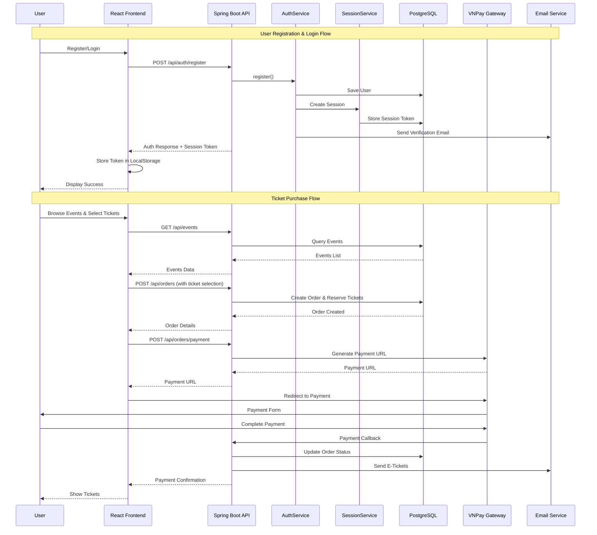
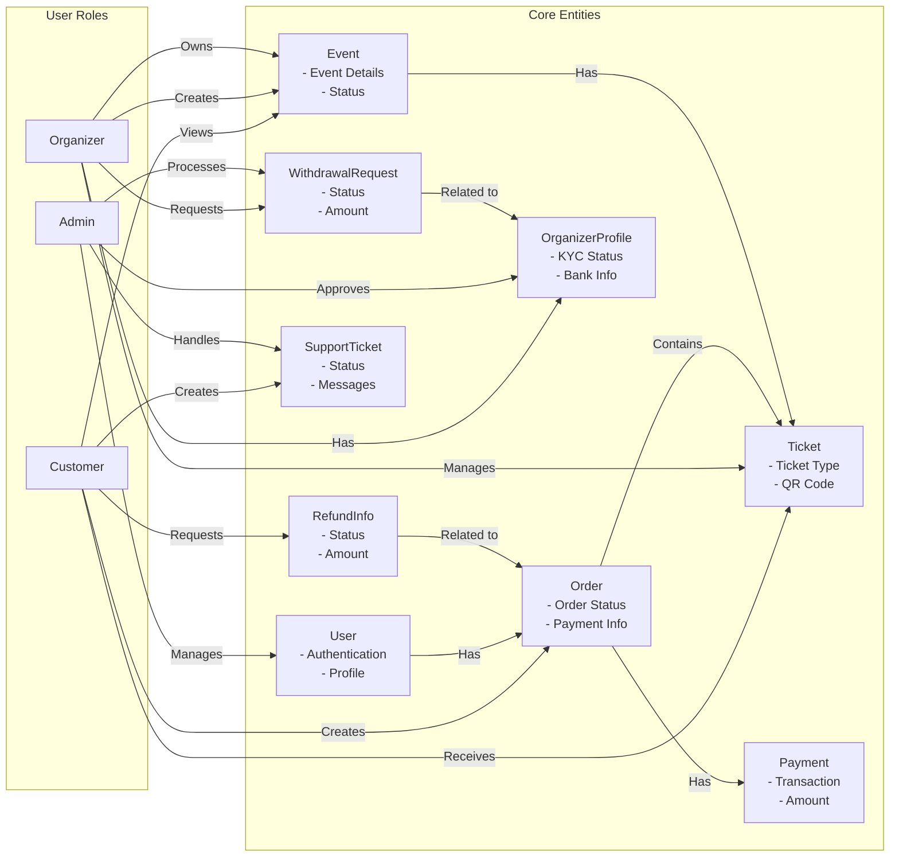
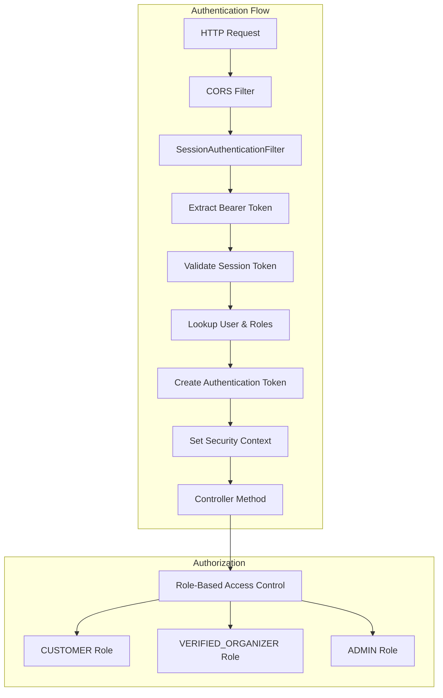

# Ticket Booking System - High Level Design

## System Overview

The Ticket Booking System is a comprehensive web-based platform designed to facilitate event ticket sales, management, and verification. The system serves three primary user roles: **Customers** who purchase tickets, **Organizers** who create and manage events, and **Administrators** who oversee system operations and user management.

### Purpose

This system provides a complete end-to-end solution for the event ticketing industry, enabling:
- **Event Discovery**: Customers can browse, search, and view event details
- **Ticket Purchasing**: Secure reservation and payment processing with order expiry management
- **Event Management**: Organizers can create, update, and manage their events with comprehensive statistics
- **Financial Operations**: Integrated payment processing, refund handling, and withdrawal requests for organizers
- **Support Services**: Customer support ticket system with email notifications
- **Access Control**: Role-based authentication and authorization for secure access to system features

### Architecture Approach

The system follows a **layered architecture** pattern with clear separation of concerns:

1. **Client Layer**: React-based web application providing separate portals for customers, organizers, and administrators
2. **API Gateway**: Load balancer routing requests to appropriate endpoints
3. **Application Layer**: Spring Boot REST API with controller, security, and service layers
4. **Data Layer**: PostgreSQL database with JPA/Hibernate ORM for data persistence
5. **External Services**: Integration with payment gateways, email services, SMS providers, and OAuth providers

### Key Design Principles

- **Security First**: Session-based authentication with role-based access control (RBAC)
- **Scalability**: Stateless API design with database-backed session management
- **Reliability**: Background job processing for order expiry and scheduled tasks
- **User Experience**: Real-time notifications via email and SMS, QR code generation for tickets
- **Maintainability**: Modular service layer architecture with clear separation of business logic

This high-level design document provides detailed diagrams, component interactions, data flows, and technical specifications to guide the development and implementation of the system.

## Architecture Layers Description

### 1. Client Layer

The **Client Layer** consists of React-based web applications that provide user interfaces for different user roles:

- **Customer Portal**: Allows customers to browse events, purchase tickets, view their orders, manage tickets, create support tickets, and request refunds
- **Organizer Portal**: Enables organizers to create and manage events, submit KYC documents, view event statistics, and request withdrawals
- **Admin Dashboard**: Provides administrators with tools to manage users, approve organizer KYC requests, process withdrawals, view system statistics, and handle support tickets

The frontend communicates with the backend via REST API calls using HTTPS, storing session tokens in LocalStorage for authenticated requests. The client layer is stateless and receives all business logic from the backend API.

### 2. API Gateway / Load Balancer

The **Load Balancer** (Port 8080) acts as the entry point for all incoming requests. It:
- Routes requests to appropriate backend services
- Handles request distribution and load balancing
- Provides a single point of entry for all API endpoints
- Can be extended to include rate limiting, SSL termination, and request logging

### 3. Application Layer - Spring Boot REST API

The application layer is organized into several sub-layers:

#### 3.1 REST Controllers

Controllers handle HTTP requests and responses, mapping URLs to business logic:

- **AuthController** (`/api/auth`): Handles user authentication, registration, login, password reset, and profile management
- **OrderController** (`/api/orders`): Manages order creation, payment initiation, order status queries, and ticket retrieval
- **OrganizerController** (`/api/organizer`): Provides organizer-specific operations including event creation, KYC submission, withdrawal requests, and event statistics
- **AdminController** (`/api/admin`): Administers system-wide operations including user management, organizer approval, withdrawal processing, and system analytics
- **SupportController** (`/api/support`): Manages customer support ticket creation, updates, and responses
- **RefundController** (`/api/refunds`): Handles refund request creation and status tracking
- **CheckInController** (`/api/checkin`): Processes ticket verification via QR code scanning at event venues
- **PublicEventController** (`/api/events`): Provides public access to event browsing, search, filtering, and event details

#### 3.2 Security Layer

The security layer ensures authentication and authorization:

- **SessionAuthenticationFilter**: Intercepts all incoming requests, extracts Bearer tokens from headers, validates session tokens against the database, and sets up Spring Security context
- **AuthenticationEntryPoint**: Handles unauthorized access attempts and returns appropriate error responses
- **SecurityConfig**: Configures Spring Security with role-based access control (RBAC), defining which roles can access which endpoints

#### 3.3 Service Layer

The service layer contains all business logic and is organized into domain-specific services (detailed descriptions below).

#### 3.4 Background Jobs

**Spring Scheduler** handles asynchronous and scheduled tasks:
- **Order Expiry Cleanup**: Automatically cancels orders that exceed the 15-minute reservation window without payment
- **Scheduled Tasks**: Runs periodic maintenance tasks, data cleanup, and reporting jobs

### 4. Data Layer

The **Data Layer** consists of:

- **JPA/Hibernate ORM**: Provides object-relational mapping, translating Java entities to database tables and handling database operations
- **PostgreSQL Database** (`ticketbook_db`): Stores all persistent data including users, events, orders, tickets, payments, sessions, and audit logs

The ORM layer abstracts database operations, allowing services to work with Java objects rather than SQL queries directly.

### 5. External Services

The system integrates with external third-party services:

- **VNPay Payment Gateway**: Processes online payments, generates payment URLs, and handles payment callbacks
- **Email Service Provider**: Sends transactional emails (verification, tickets, notifications) via SMTP or Email API
- **SMS Service Provider**: Delivers SMS notifications for critical events (optional)
- **Google OAuth2**: Provides social login functionality (configured but currently commented out)

## Service Layer Description

The service layer implements all business logic and domain operations. Each service is responsible for a specific domain area:

### Core Business Services

#### AuthService
Handles user authentication and account management:
- **User Registration**: Creates new user accounts with email/phone validation
- **Login**: Authenticates users and creates session tokens
- **Password Reset**: Generates reset tokens and sends password reset emails
- **Profile Management**: Updates user profile information
- **Session Management**: Works with SessionService to maintain user sessions
- **Dependencies**: EmailService (verification emails), SMSService (SMS verification), SessionService

#### OrderService
Manages the complete order lifecycle:
- **Order Creation**: Creates orders with ticket reservations and calculates totals
- **Payment Processing**: Coordinates with VNPayService for payment initiation and callback handling
- **Ticket Generation**: Creates ticket entities with QR codes after successful payment
- **Order Status Management**: Tracks order status (PENDING, PAID, CANCELLED, EXPIRED)
- **Order Expiry**: Handles automatic cancellation of unpaid orders after 15 minutes
- **Dependencies**: EventService (validate event availability), QRCodeService (generate ticket QR codes), EmailService (send e-tickets)

#### EventService
Manages event-related operations:
- **Event CRUD**: Create, read, update, and delete events
- **Event Search**: Provides filtering, searching, and pagination for event listings
- **Event Status Management**: Handles event lifecycle (DRAFT, PUBLISHED, ONGOING, COMPLETED, CANCELLED)
- **Ticket Type Management**: Manages different ticket types and pricing for events
- **Availability Checking**: Validates ticket availability before order creation

#### OrganizerService
Handles organizer-specific operations:
- **KYC Verification**: Manages Know Your Customer document submission and verification workflow
- **Profile Management**: Maintains organizer profile information including bank account details
- **Event Creation**: Validates organizer permissions before allowing event creation
- **Withdrawal Management**: Processes withdrawal requests and tracks withdrawal status
- **Dependencies**: EmailService (notifications for KYC approval/rejection)

#### CheckInService
Manages ticket verification at event venues:
- **QR Code Verification**: Validates QR codes from tickets during check-in
- **Ticket Validation**: Ensures tickets are valid, not already used, and belong to the correct event
- **Check-in Recording**: Marks tickets as checked in and prevents duplicate check-ins
- **Real-time Validation**: Provides immediate feedback for valid/invalid tickets

### Payment & Financial Services

#### VNPayService
Integrates with VNPay payment gateway:
- **Payment URL Generation**: Creates secure payment URLs with order details
- **Payment Callback Handling**: Processes payment callbacks from VNPay and updates order status
- **Payment Verification**: Validates payment signatures and transaction authenticity
- **Payment Status Tracking**: Maintains payment records and transaction history

#### RefundService
Handles refund processing:
- **Refund Request Processing**: Validates refund eligibility and creates refund records
- **Payment Reversal**: Coordinates with VNPayService to reverse payments
- **Refund Status Management**: Tracks refund status (PENDING, APPROVED, REJECTED, COMPLETED)
- **Dependencies**: PaymentService (payment reversal), EmailService (refund notifications)

#### WithdrawalService
Manages organizer withdrawal requests:
- **Withdrawal Request Creation**: Validates organizer balance and creates withdrawal requests
- **Withdrawal Processing**: Handles admin approval and bank transfer coordination
- **Balance Management**: Tracks organizer earnings and available balance
- **Dependencies**: EmailService (withdrawal notifications)

### Support Services

#### SupportService
Manages customer support operations:
- **Ticket Creation**: Creates support tickets from customer inquiries
- **Ticket Management**: Updates ticket status, assigns to admins, and tracks responses
- **Message Threading**: Maintains conversation threads within support tickets
- **Status Tracking**: Manages ticket lifecycle (OPEN, IN_PROGRESS, RESOLVED, CLOSED)
- **Dependencies**: EmailService (notifications for new tickets and responses)

### Administrative Services

#### AdminService
Provides administrative operations:
- **User Management**: View, update, and manage user accounts
- **Organizer Approval**: Approves or rejects organizer KYC submissions
- **Withdrawal Processing**: Approves and processes organizer withdrawal requests
- **System Monitoring**: Accesses system health and performance metrics

#### StatisticsService
Provides analytics and reporting:
- **Event Statistics**: Calculates event performance metrics (sales, attendance, revenue)
- **System Statistics**: Generates system-wide analytics and reports
- **Revenue Analytics**: Tracks revenue by event, organizer, and time period
- **User Analytics**: Provides user engagement and activity statistics

### Utility Services

#### EmailService
Handles all email communications:
- **Transactional Emails**: Sends verification emails, password reset emails, order confirmations
- **E-Ticket Delivery**: Sends tickets with QR codes to customers after payment
- **Notification Emails**: Delivers various system notifications to users
- **Template Management**: Manages email templates for different notification types

#### SMSService
Provides SMS notification capabilities:
- **SMS Delivery**: Sends SMS notifications for critical events
- **Verification Codes**: Delivers OTP codes for phone verification
- **Template Management**: Manages SMS message templates

#### QRCodeService
Generates QR codes for tickets:
- **QR Code Generation**: Creates unique QR codes for each ticket
- **Code Encoding**: Encodes ticket information (ticket ID, event ID, order ID) into QR format
- **Format Support**: Generates QR codes in various formats (PNG, SVG)

### Service Dependencies

Services communicate with each other through well-defined interfaces:
- **OrderService** depends on EventService (validate events), QRCodeService (generate tickets), EmailService (send tickets)
- **AuthService** depends on EmailService (verification emails), SMSService (phone verification)
- **RefundService** depends on PaymentService (payment reversal), EmailService (notifications)
- **WithdrawalService** and **SupportService** depend on EmailService for notifications

All services interact with the Data Layer through JPA repositories to persist and retrieve data.

## System Architecture Diagram

```mermaid
graph TB
    subgraph "Client Layer"
        WEB[React Web Application<br/>- Customer Portal<br/>- Organizer Portal<br/>- Admin Dashboard]
        MOBILE[Mobile App<br/>Optional Future]
    end

    subgraph "API Gateway / Load Balancer"
        LB[Load Balancer<br/>Port 8080]
    end

    subgraph "Application Layer - Spring Boot REST API"
        subgraph "REST Controllers"
            AUTH_CTRL[AuthController<br/>/api/auth]
            ORDER_CTRL[OrderController<br/>/api/orders]
            ORG_CTRL[OrganizerController<br/>/api/organizer]
            ADMIN_CTRL[AdminController<br/>/api/admin]
            SUPPORT_CTRL[SupportController<br/>/api/support]
            REFUND_CTRL[RefundController<br/>/api/refunds]
            CHECKIN_CTRL[CheckInController<br/>/api/checkin]
            PUBLIC_CTRL[PublicEventController<br/>/api/events]
        end

        subgraph "Security Layer"
            SEC_FILTER[SessionAuthenticationFilter]
            AUTH_ENTRY[AuthenticationEntryPoint]
            SEC_CONFIG[SecurityConfig<br/>Role-Based Access Control]
        end

        subgraph "Service Layer"
            AUTH_SVC[AuthService<br/>- Registration/Login<br/>- Password Reset<br/>- Profile Management]
            ORDER_SVC[OrderService<br/>- Order Creation<br/>- Payment Processing<br/>- Ticket Generation]
            EVENT_SVC[EventService<br/>- Event CRUD<br/>- Event Management]
            ORG_SVC[OrganizerService<br/>- KYC Verification<br/>- Profile Management<br/>- Event Creation]
            PAYMENT_SVC[VNPayService<br/>- Payment Gateway Integration]
            EMAIL_SVC[EmailService<br/>- Email Notifications]
            SMS_SVC[SMSService<br/>- SMS Notifications]
            QR_SVC[QRCodeService<br/>- QR Code Generation]
            REFUND_SVC[RefundService<br/>- Refund Processing]
            WITHDRAWAL_SVC[WithdrawalService<br/>- Withdrawal Requests]
            SUPPORT_SVC[SupportService<br/>- Ticket Management]
            ADMIN_SVC[AdminService<br/>- Admin Operations]
            STATS_SVC[StatisticsService<br/>- Analytics & Reports]
            CHECKIN_SVC[CheckInService<br/>- Ticket Verification]
        end

        subgraph "Background Jobs"
            SCHEDULER[Spring Scheduler<br/>- Order Expiry Cleanup<br/>- Scheduled Tasks]
        end
    end

    subgraph "Data Layer"
        JPA[JPA/Hibernate<br/>ORM Layer]
        DB[(PostgreSQL Database<br/>ticketbook_db)]
    end

    subgraph "External Services"
        VNPAY[VNPay Payment Gateway<br/>Payment Processing]
        EMAIL_PROVIDER[Email Service Provider<br/>SMTP/API]
        SMS_PROVIDER[SMS Service Provider<br/>API]
        OAUTH_GOOGLE[Google OAuth2<br/>Social Login]
    end

    %% Client to API Gateway
    WEB -->|HTTPS/REST API| LB
    MOBILE -.->|Future| LB

    %% API Gateway to Controllers
    LB --> AUTH_CTRL
    LB --> ORDER_CTRL
    LB --> ORG_CTRL
    LB --> ADMIN_CTRL
    LB --> SUPPORT_CTRL
    LB --> REFUND_CTRL
    LB --> CHECKIN_CTRL
    LB --> PUBLIC_CTRL

    %% Security Filter
    LB -.->|All Requests| SEC_FILTER
    SEC_FILTER --> AUTH_CTRL
    SEC_FILTER --> ORDER_CTRL
    SEC_FILTER --> ORG_CTRL
    SEC_FILTER --> ADMIN_CTRL
    SEC_FILTER --> SUPPORT_CTRL
    SEC_FILTER --> REFUND_CTRL
    SEC_FILTER --> CHECKIN_CTRL

    %% Controllers to Services
    AUTH_CTRL --> AUTH_SVC
    ORDER_CTRL --> ORDER_SVC
    ORDER_CTRL --> PAYMENT_SVC
    PUBLIC_CTRL --> EVENT_SVC
    ORG_CTRL --> ORG_SVC
    ORG_CTRL --> EVENT_SVC
    ADMIN_CTRL --> ADMIN_SVC
    ADMIN_CTRL --> ORG_SVC
    ADMIN_CTRL --> STATS_SVC
    SUPPORT_CTRL --> SUPPORT_SVC
    REFUND_CTRL --> REFUND_SVC
    CHECKIN_CTRL --> CHECKIN_SVC

    %% Service Dependencies
    ORDER_SVC --> EVENT_SVC
    ORDER_SVC --> QR_SVC
    ORDER_SVC --> EMAIL_SVC
    AUTH_SVC --> EMAIL_SVC
    AUTH_SVC --> SMS_SVC
    ORG_SVC --> EMAIL_SVC
    REFUND_SVC --> PAYMENT_SVC
    REFUND_SVC --> EMAIL_SVC
    WITHDRAWAL_SVC --> EMAIL_SVC
    SUPPORT_SVC --> EMAIL_SVC

    %% Services to External Services
    PAYMENT_SVC --> VNPAY
    EMAIL_SVC --> EMAIL_PROVIDER
    SMS_SVC --> SMS_PROVIDER
    AUTH_SVC -.->|OAuth2| OAUTH_GOOGLE

    %% Services to Data Layer
    AUTH_SVC --> JPA
    ORDER_SVC --> JPA
    EVENT_SVC --> JPA
    ORG_SVC --> JPA
    PAYMENT_SVC --> JPA
    REFUND_SVC --> JPA
    WITHDRAWAL_SVC --> JPA
    SUPPORT_SVC --> JPA
    ADMIN_SVC --> JPA
    STATS_SVC --> JPA
    CHECKIN_SVC --> JPA

    %% Background Jobs
    SCHEDULER --> ORDER_SVC

    %% Data Layer
    JPA --> DB

    %% Styling
    classDef clientLayer fill:#e1f5ff,stroke:#01579b,stroke-width:2px
    classDef apiLayer fill:#fff3e0,stroke:#e65100,stroke-width:2px
    classDef serviceLayer fill:#f3e5f5,stroke:#4a148c,stroke-width:2px
    classDef dataLayer fill:#e8f5e9,stroke:#1b5e20,stroke-width:2px
    classDef externalLayer fill:#fce4ec,stroke:#880e4f,stroke-width:2px

    class WEB,MOBILE clientLayer
    class AUTH_CTRL,ORDER_CTRL,ORG_CTRL,ADMIN_CTRL,SUPPORT_CTRL,REFUND_CTRL,CHECKIN_CTRL,PUBLIC_CTRL,SEC_FILTER,AUTH_ENTRY,SEC_CONFIG apiLayer
    class AUTH_SVC,ORDER_SVC,EVENT_SVC,ORG_SVC,PAYMENT_SVC,EMAIL_SVC,SMS_SVC,QR_SVC,REFUND_SVC,WITHDRAWAL_SVC,SUPPORT_SVC,ADMIN_SVC,STATS_SVC,CHECKIN_SVC,SCHEDULER serviceLayer
    class JPA,DB dataLayer
    class VNPAY,EMAIL_PROVIDER,SMS_PROVIDER,OAUTH_GOOGLE externalLayer
```

## Component Interaction Flow

## Data Flow Diagram

## Technology Stack

### Frontend (React)
- **Framework**: React.js
- **State Management**: React Context/Redux (assumed)
- **HTTP Client**: Axios/Fetch
- **Authentication**: Bearer Token (Session Token)
- **Port**: 3000 (development)

### Backend (Spring Boot)
- **Framework**: Spring Boot 3.5.7
- **Language**: Java 21
- **Security**: Spring Security with Session-based Authentication
- **ORM**: JPA/Hibernate
- **API**: RESTful API
- **Port**: 8080

### Database
- **Type**: PostgreSQL
- **Database**: ticketbook_db
- **Connection**: JDBC

### External Integrations
- **Payment**: VNPay Payment Gateway
- **Email**: SMTP/Email API Service
- **SMS**: SMS API Service
- **OAuth**: Google OAuth2 (configured but commented)
- **QR Code**: QR Code Generation Library

### Infrastructure
- **Session Management**: Database-backed sessions (24h timeout)
- **File Upload**: Multipart (max 10MB)
- **Background Jobs**: Spring Scheduler
- **CORS**: Configured for React frontend

## Security Architecture

## API Endpoints Overview

### Public Endpoints
- `/api/auth/register` - User Registration
- `/api/auth/login` - User Login
- `/api/auth/forgot-password` - Password Reset Request
- `/api/events` - Browse Events
- `/api/events/{id}` - Event Details

### Customer Endpoints
- `/api/auth/profile` - Profile Management
- `/api/orders` - Order Management
- `/api/tickets` - Ticket Management
- `/api/support` - Support Tickets
- `/api/refunds` - Refund Requests

### Organizer Endpoints
- `/api/organizer/**` - Organizer Operations
  - Event Creation/Management
  - KYC Submission
  - Withdrawal Requests
  - Event Statistics

### Admin Endpoints
- `/api/admin/**` - Admin Operations
  - User Management
  - Organizer Approval
  - Withdrawal Processing
  - System Statistics
  - Audit Logs

## Key Features

1. **User Management**
   - Registration with email/phone verification
   - Session-based authentication
   - Password reset functionality
   - Profile management

2. **Event Management**
   - Event creation (Organizers)
   - Event browsing (Public/Customers)
   - Event search and filtering
   - Category management

3. **Order & Payment**
   - Ticket reservation system
   - VNPay payment integration
   - Order expiry (15 minutes)
   - QR code generation for tickets

4. **Organizer Features**
   - KYC verification
   - Event creation and management
   - Withdrawal requests
   - Event statistics

5. **Admin Features**
   - User management
   - Organizer approval
   - Withdrawal processing
   - System statistics
   - Audit logging

6. **Support System**
   - Support ticket creation
   - Ticket management
   - Email notifications

7. **Refund System**
   - Refund request processing
   - Payment reversal

8. **Check-in System**
   - QR code verification
   - Ticket validation

