# Integrated Communication Diagrams (ICD)
## Ticket Booking System

---

## 1. High-Level System Architecture

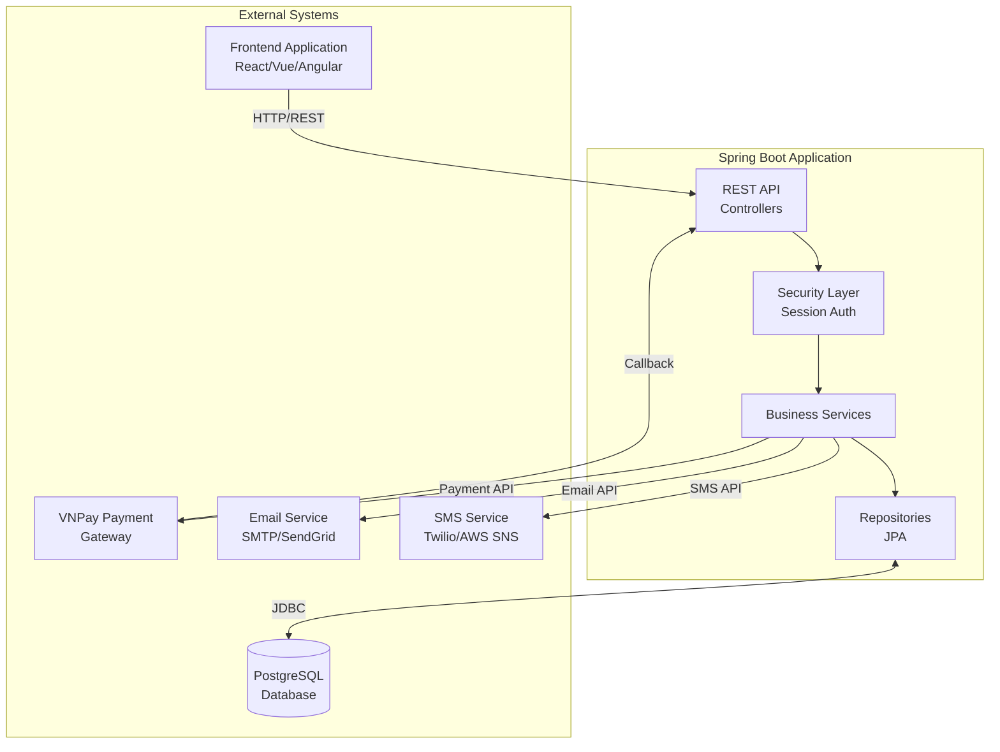

---

## 2. Authentication Flow Communication

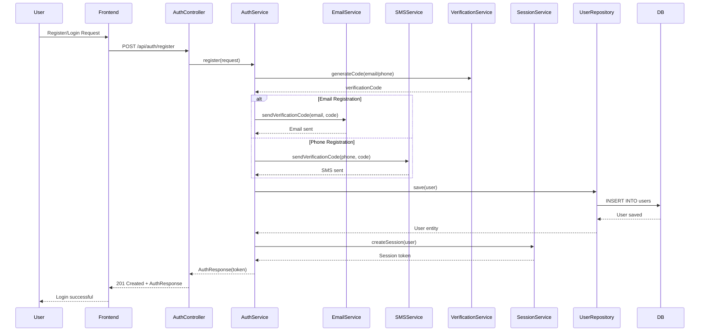

---

## 3. Order & Payment Flow Communication

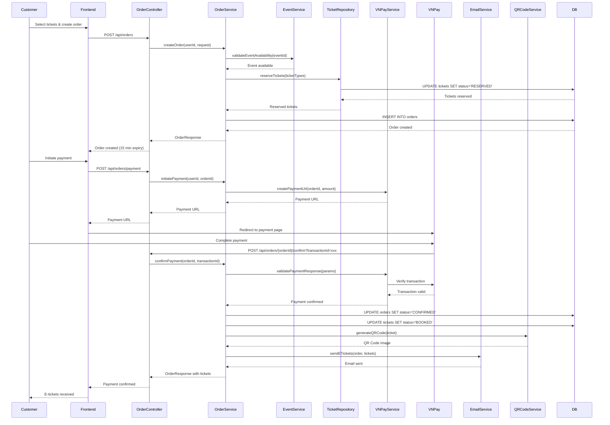

---

## 4. Event Management Communication (Organizer)

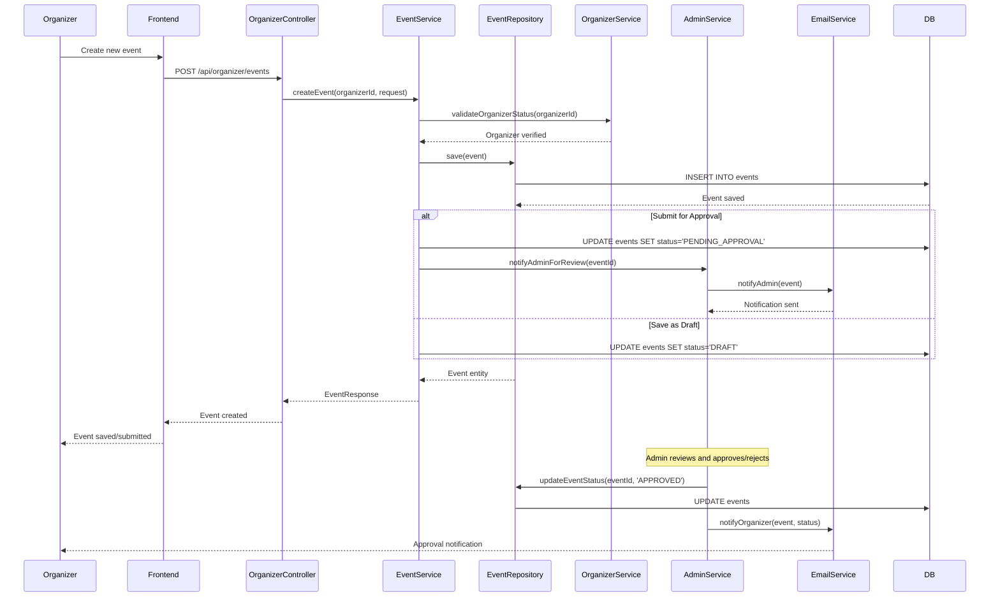

---

## 5. Check-In Process Communication

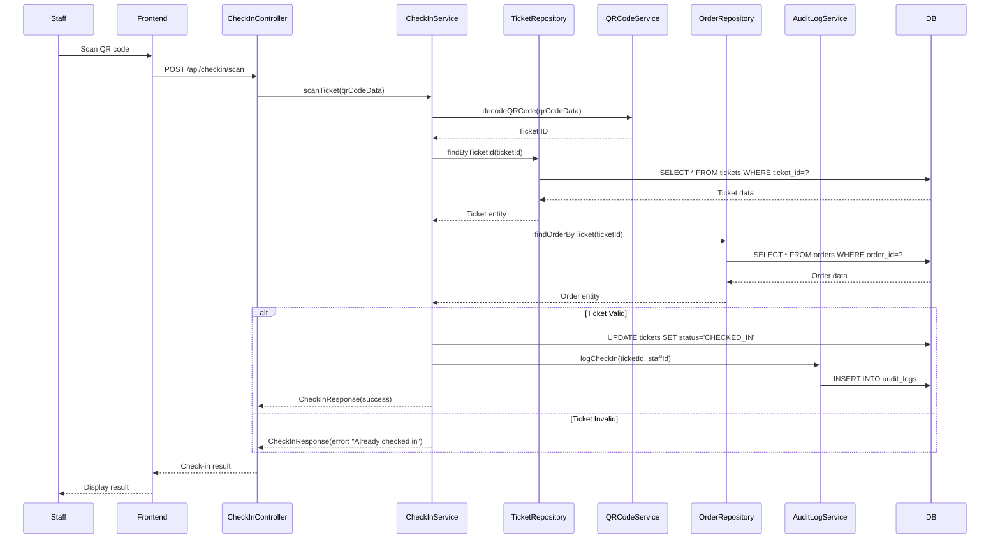

---

## 6. Refund Process Communication

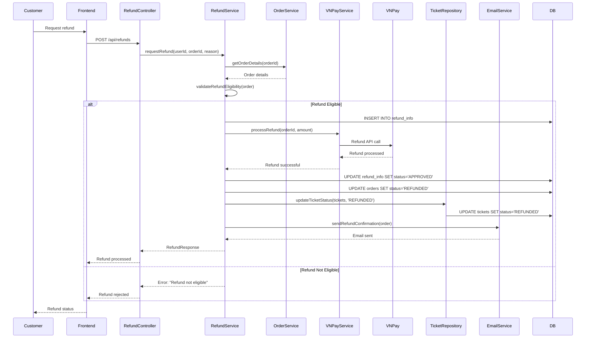

---

## 7. Support Ticket Communication Flow

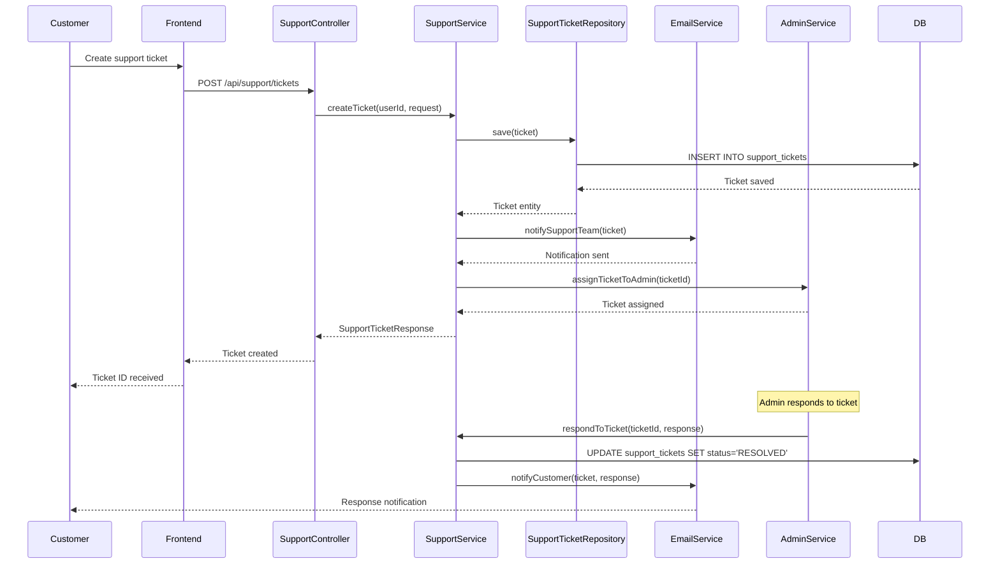

---

## 8. Admin Management Communication

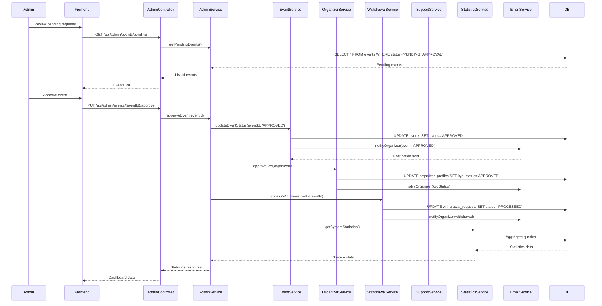

---

## 9. Component Interaction Overview

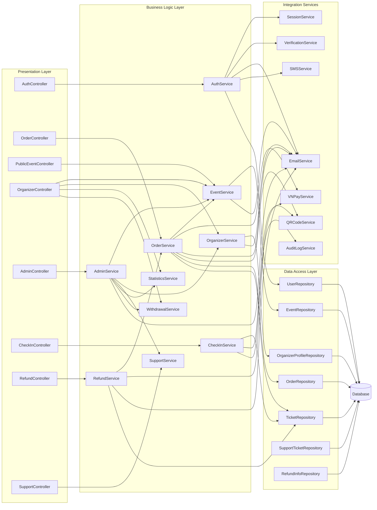

---

## 10. External Service Integration

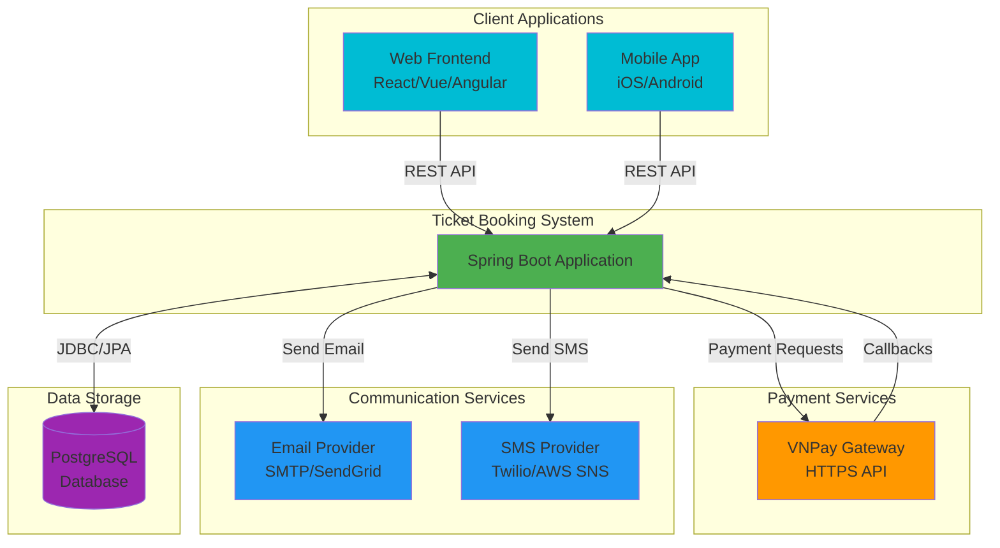

---

## 11. Security & Session Management Flow

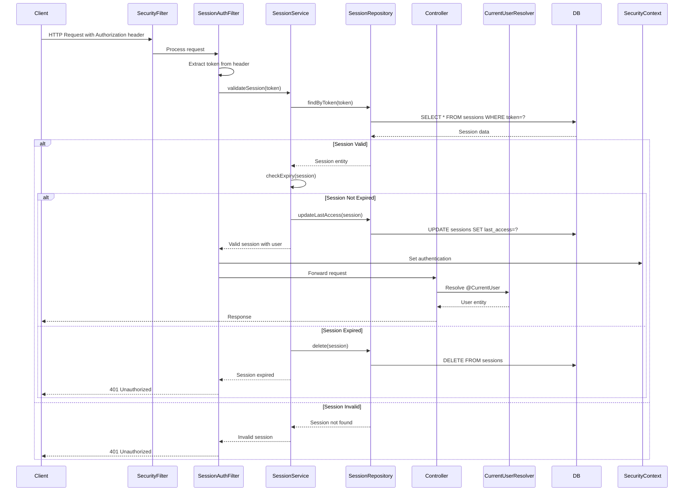

---

## Notes

### Communication Patterns:

1. **REST API**: All client communication uses REST over HTTP/HTTPS
2. **Session-based Authentication**: Custom session management with token-based approach
3. **Service Layer Pattern**: Controllers delegate to services, services handle business logic
4. **Repository Pattern**: Data access abstracted through JPA repositories
5. **External Service Integration**: Asynchronous communication with payment, email, and SMS services
6. **Database**: PostgreSQL with JPA/Hibernate for ORM

### Key Integrations:

- **VNPay**: Payment gateway for processing payments and refunds
- **Email Service**: SMTP/SendGrid for sending notifications and e-tickets
- **SMS Service**: Twilio/AWS SNS for verification codes and alerts
- **Database**: PostgreSQL for persistent data storage

### Security:

- Session tokens stored in database
- Session expiry (24 hours default)
- Role-based access control (CUSTOMER, VERIFIED_ORGANIZER, ADMIN)
- CORS configuration for frontend integration

