# Integrated Communication Diagrams (ICD)
## Ticket Booking System

## Giải thích về các loại Diagram

### Communication Diagram (Diagram Giao Tiếp) là gì?

**Communication Diagram** (trong UML còn gọi là **Collaboration Diagram**) là một loại diagram mô tả:
- **Các đối tượng/component** trong hệ thống
- **Cách chúng tương tác và giao tiếp** với nhau
- **Luồng thông điệp** giữa các đối tượng
- **Mối quan hệ** giữa các thành phần

**Đặc điểm:**
- Tập trung vào **cấu trúc** và **mối quan hệ** giữa các đối tượng
- Hiển thị các **đường kết nối** (links) giữa các đối tượng
- Đánh số thứ tự các thông điệp để thể hiện **thứ tự thực thi**

**So sánh với Sequence Diagram:**
- **Sequence Diagram**: Tập trung vào **thứ tự thời gian**, các đối tượng được sắp xếp theo trục thời gian
- **Communication Diagram**: Tập trung vào **cấu trúc và mối quan hệ**, các đối tượng được sắp xếp tự do trong không gian

### Các loại Diagram trong file này:

File này bao gồm nhiều loại diagram để mô tả đầy đủ hệ thống:

1. **Graph/Flowchart Diagrams** (Diagram 1, 9, 10): Mô tả cấu trúc và luồng dữ liệu
2. **Sequence Diagrams** (Diagram 2-8, 11): Mô tả luồng tương tác theo thời gian
3. **Component Diagrams** (Diagram 9): Mô tả cấu trúc component và dependencies

**Lý do sử dụng "Communication" trong tên:**
- Tất cả các diagram đều tập trung vào **communication** (giao tiếp) giữa các thành phần
- Mô tả cách các module **tương tác và trao đổi thông tin** với nhau
- Phù hợp với mục đích của **Integrated Communication Diagrams (ICD)** - mô tả toàn bộ giao tiếp trong hệ thống

### Ví dụ Communication Diagram thuần túy (UML):

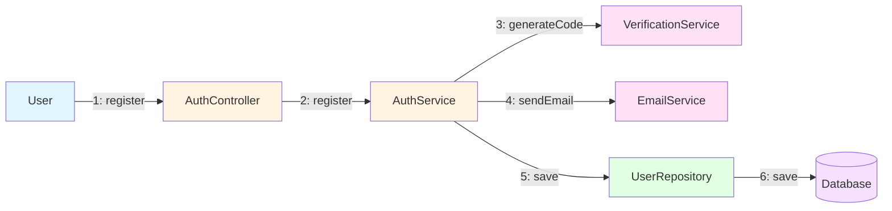

**Giải thích:**
- Các số 1, 2, 3... thể hiện **thứ tự** các thông điệp được gửi
- Các mũi tên thể hiện **hướng giao tiếp** giữa các đối tượng
- Layout tự do, tập trung vào **mối quan hệ** giữa các component

**So sánh với Sequence Diagram:**
- Sequence Diagram: Sắp xếp theo trục thời gian (từ trên xuống)
- Communication Diagram: Sắp xếp tự do, tập trung vào cấu trúc

---

## III. Analysis Models - Interaction Diagrams

### III.1.1. Sequence Diagrams

Các Sequence Diagrams được mô tả ở các phần sau (Diagram 2-8, 11), tập trung vào **thứ tự thời gian** của các tương tác.

---

### III.1.2. Communication Diagrams (UML Collaboration Diagrams)

**Communication Diagrams** mô tả cùng một luồng tương tác như Sequence Diagrams nhưng tập trung vào **cấu trúc và mối quan hệ** giữa các đối tượng. Các đặc điểm:

- **Objects**: Các đối tượng được biểu diễn bằng hình chữ nhật
- **Links**: Đường kết nối giữa các đối tượng (thể hiện mối quan hệ)
- **Messages**: Được đánh số theo thứ tự (1, 2, 3...) để thể hiện luồng thực thi
- **Nested Messages**: Có thể có số thứ tự lồng nhau (1.1, 1.2, ...)
- **Layout**: Tự do, tập trung vào cấu trúc quan hệ, không bắt buộc theo thời gian

---

#### Communication Diagram 1: Authentication Flow

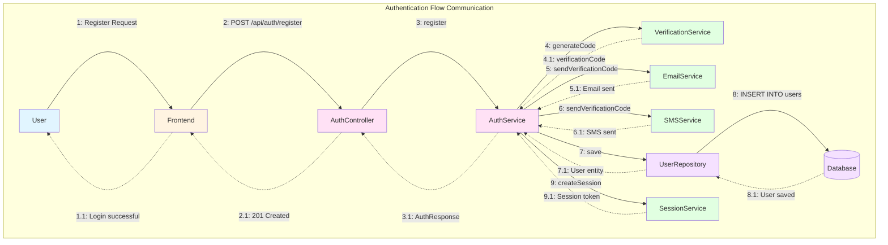

**Ghi chú:**
- Mũi tên liền (`-->`): Gọi method/request
- Mũi tên đứt (`-.->`): Response/return value
- Số thứ tự (1, 2, 3...): Thể hiện thứ tự thực thi
- Layout tự do: Tập trung vào mối quan hệ giữa các đối tượng

---

#### Communication Diagram 2: Order & Payment Flow

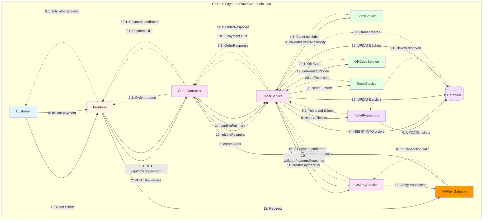

---

#### Communication Diagram 3: Event Management (Organizer)

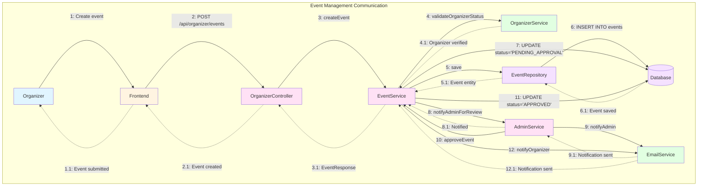

---

#### Communication Diagram 4: Check-In Process

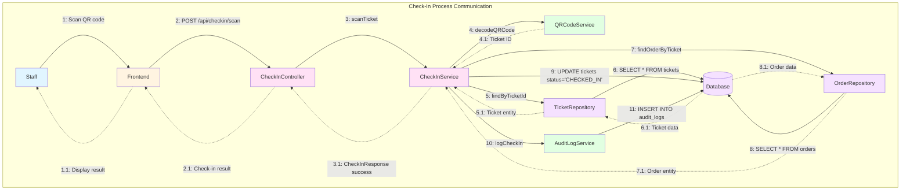

---

#### Communication Diagram 5: Refund Process

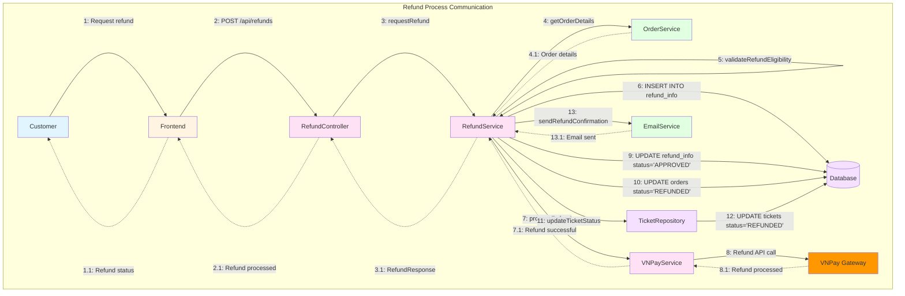

---

#### Communication Diagram 6: Support Ticket Flow

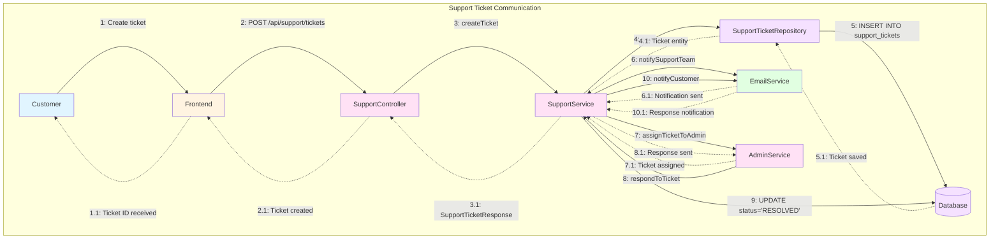

---

#### Communication Diagram 7: Admin Management

```mermaid
graph TB
    subgraph "Admin Management Communication"
        ADM[Admin]
        FE[Frontend]
        ADC[AdminController]
        ADMS[AdminService]
        EVS[EventService]
        ORGS[OrganizerService]
        WDS[WithdrawalService]
        SS[SupportService]
        STS[StatisticsService]
        EML[EmailService]
        DB[(Database)]
    end

    ADM -->|1: Review requests| FE
    FE -->|2: GET /api/admin/events/pending| ADC
    ADC -->|3: getPendingEvents| ADMS
    ADMS -->|4: SELECT * FROM events| DB
    DB -.->|4.1: Pending events| ADMS
    ADMS -.->|3.1: List of events| ADC
    ADC -.->|2.1: Events list| FE
    
    ADM -->|5: Approve event| FE
    FE -->|6: PUT /api/admin/events/{id}/approve| ADC
    ADC -->|7: approveEvent| ADMS
    ADMS -->|8: updateEventStatus| EVS
    EVS -->|9: UPDATE status='APPROVED'| DB
    EVS -->|10: notifyOrganizer| EML
    EML -.->|10.1: Notification sent| EVS
    
    ADMS -->|11: approveKyc| ORGS
    ORGS -->|12: UPDATE kyc_status='APPROVED'| DB
    ORGS -->|13: notifyOrganizer| EML
    EML -.->|13.1: Notification sent| ORGS
    
    ADMS -->|14: processWithdrawal| WDS
    WDS -->|15: UPDATE status='PROCESSED'| DB
    WDS -->|16: notifyOrganizer| EML
    EML -.->|16.1: Notification sent| WDS
    
    ADMS -->|17: getSystemStatistics| STS
    STS -->|18: Aggregate queries| DB
    DB -.->|18.1: Statistics data| STS
    STS -.->|17.1: System stats| ADMS
    ADMS -.->|6.1: Statistics response| ADC
    ADC -.->|5.1: Dashboard data| FE

    style ADM fill:#e1f5ff
    style FE fill:#fff4e1
    style ADC fill:#ffe1f5
    style ADMS fill:#ffe1f5
    style EVS fill:#e1ffe1
    style ORGS fill:#e1ffe1
    style WDS fill:#e1ffe1
    style SS fill:#e1ffe1
    style STS fill:#e1ffe1
    style EML fill:#e1ffe1
    style DB fill:#f5e1ff
```

---

#### Communication Diagram 8: Session Management & Security

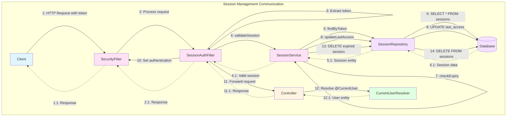

---

### So sánh Sequence Diagram vs Communication Diagram

| Đặc điểm | Sequence Diagram | Communication Diagram |
|----------|------------------|----------------------|
| **Trọng tâm** | Thứ tự thời gian | Cấu trúc và mối quan hệ |
| **Layout** | Sắp xếp theo trục thời gian (trên→dưới) | Layout tự do |
| **Đối tượng** | Lifelines (đường sống) | Objects (hình chữ nhật) |
| **Messages** | Mũi tên theo thời gian | Số thứ tự trên links |
| **Ưu điểm** | Dễ theo dõi luồng thời gian | Dễ thấy cấu trúc quan hệ |
| **Phù hợp** | Phân tích luồng thực thi | Phân tích kiến trúc |

---

## 1. High-Level System Architecture

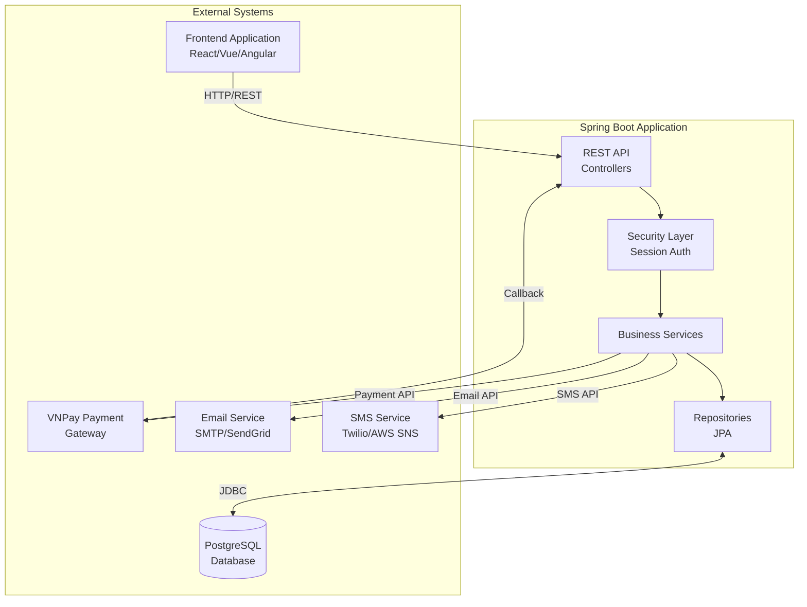

---

## 2. Authentication Flow Communication

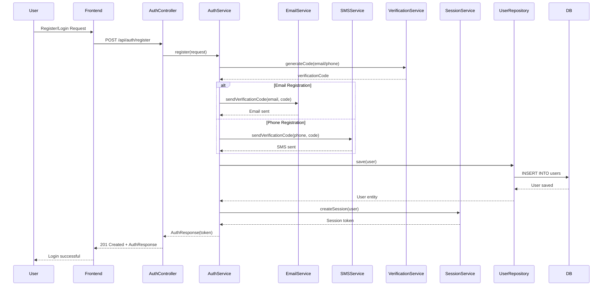

---

## 3. Order & Payment Flow Communication

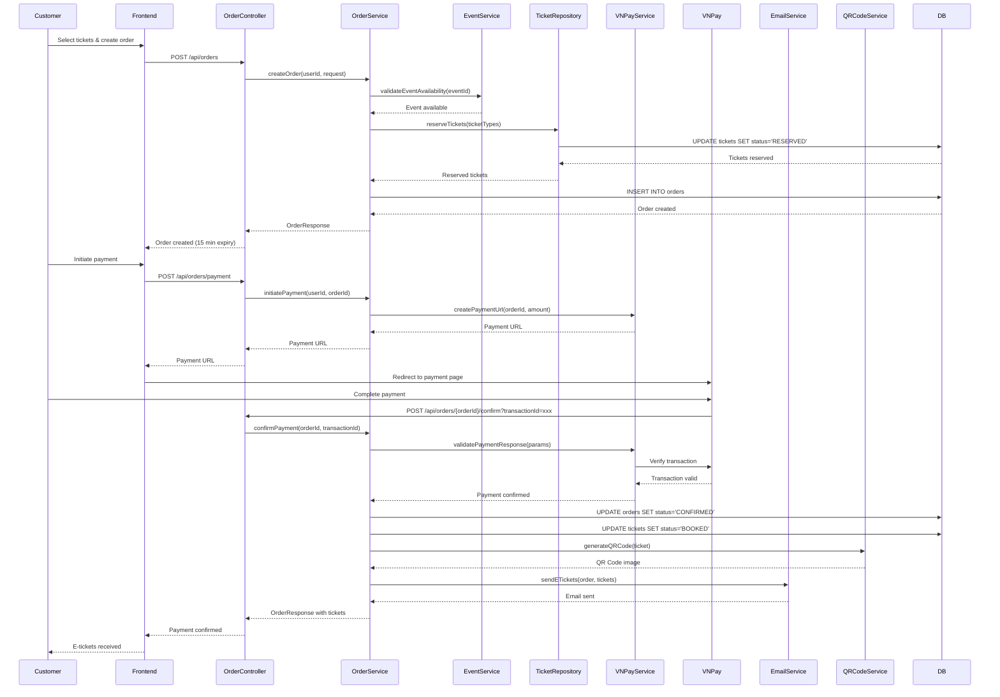

---

## 4. Event Management Communication (Organizer)

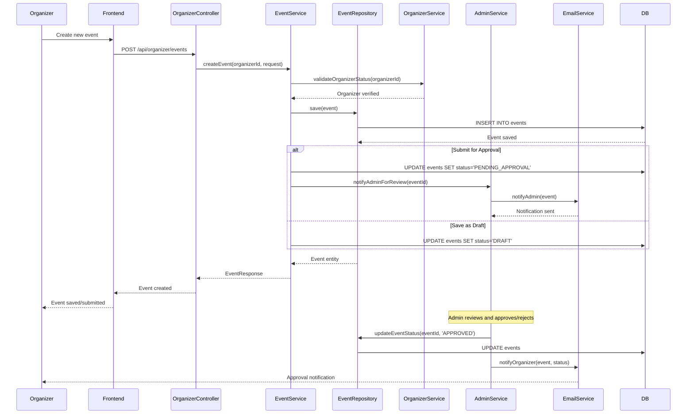

---

## 5. Check-In Process Communication

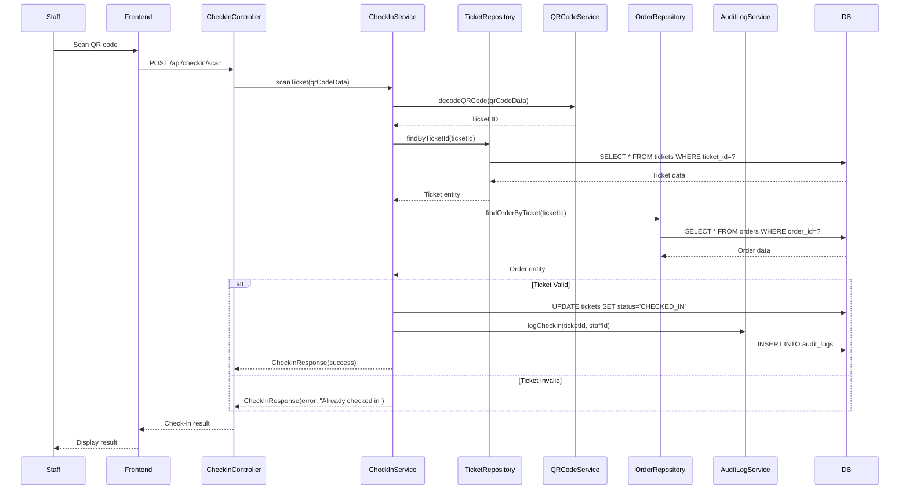

---

## 6. Refund Process Communication

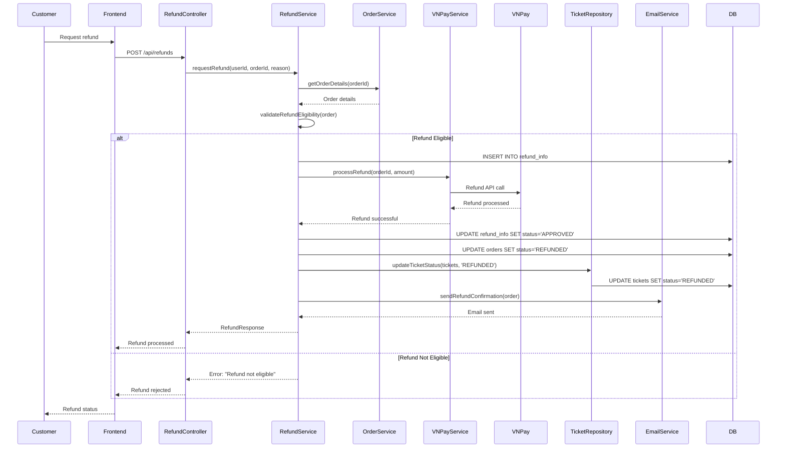

---

## 7. Support Ticket Communication Flow

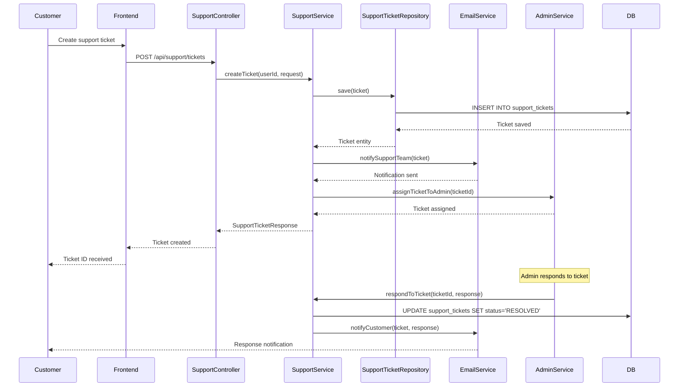

---

## 8. Admin Management Communication

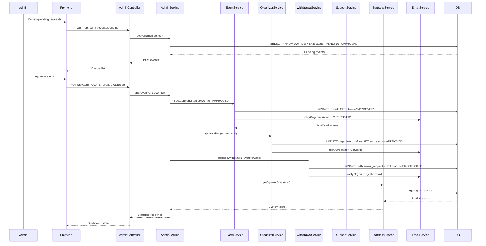

---

## 9. Component Interaction Overview

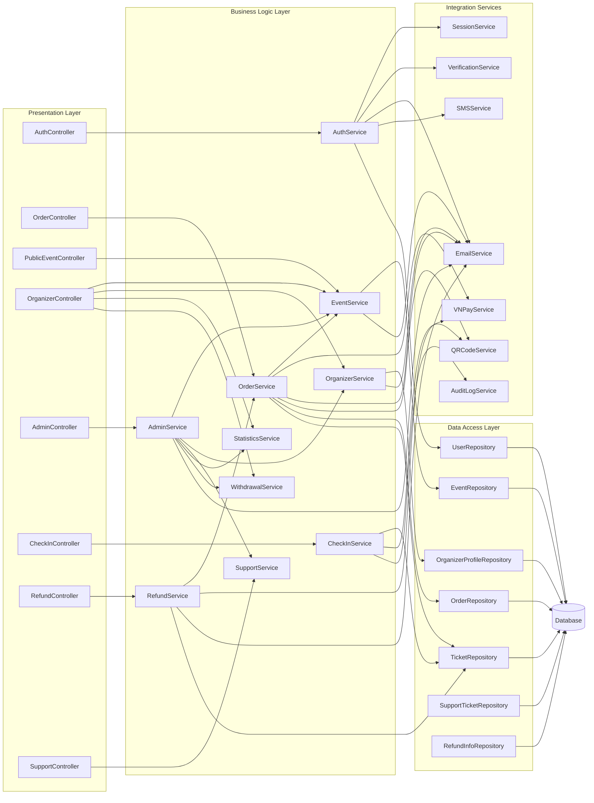

---

## 10. External Service Integration

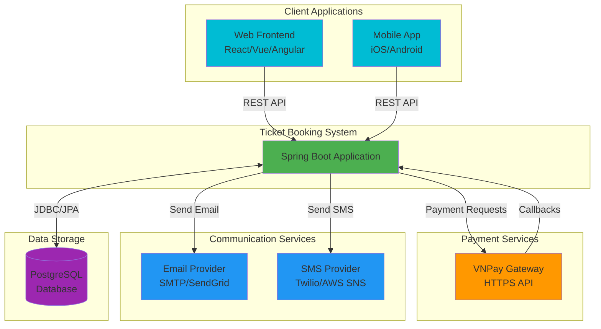

---

## 11. Security & Session Management Flow

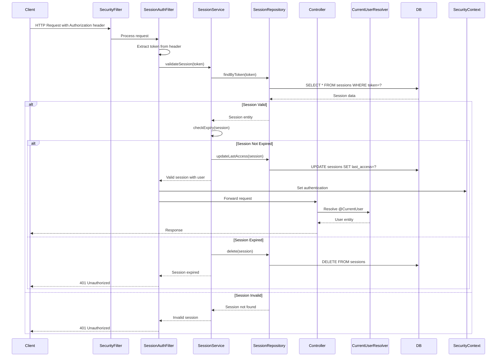

---

## Notes

### Communication Patterns:

1. **REST API**: All client communication uses REST over HTTP/HTTPS
2. **Session-based Authentication**: Custom session management with token-based approach
3. **Service Layer Pattern**: Controllers delegate to services, services handle business logic
4. **Repository Pattern**: Data access abstracted through JPA repositories
5. **External Service Integration**: Asynchronous communication with payment, email, and SMS services
6. **Database**: PostgreSQL with JPA/Hibernate for ORM

### Key Integrations:

- **VNPay**: Payment gateway for processing payments and refunds
- **Email Service**: SMTP/SendGrid for sending notifications and e-tickets
- **SMS Service**: Twilio/AWS SNS for verification codes and alerts
- **Database**: PostgreSQL for persistent data storage

### Security:

- Session tokens stored in database
- Session expiry (24 hours default)
- Role-based access control (CUSTOMER, VERIFIED_ORGANIZER, ADMIN)
- CORS configuration for frontend integration

